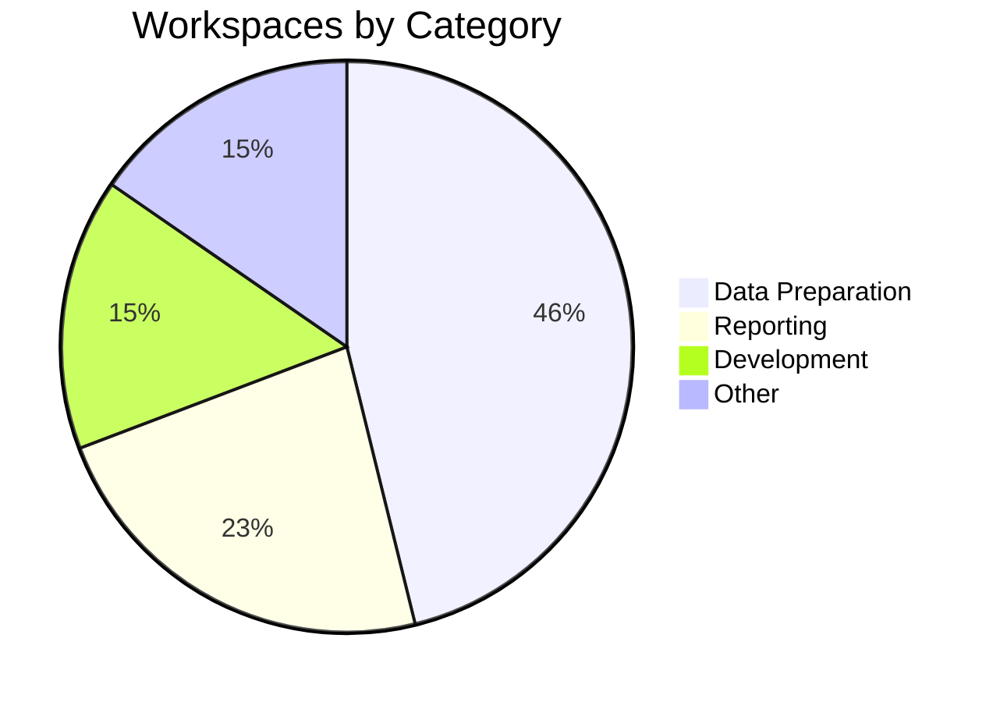

# Fabric Workspace Dashboard

**Generated:** July 17, 2026 08:01:33
**Documentation System:** Automated

---

## Executive Summary

| Metric | Value |
|--------|-------|
| Total Workspaces | 13 |
| Total Items | 230 |
| Average Items per Workspace | 17.7 |
| Largest Workspace | LH_Master_Data (94 items) |
| Documentation Files | 156 |

---

## Workspace Distribution

---

## All Workspaces

| Workspace | Category | Items | Size Bar |
|-----------|----------|-------|----------|
| LH_Master_Data | Data Preparation | 94 | ██████████ |
| RP - Sandbox | Development | 24 | ███ |
| RP - Parts Reports | Reporting | 19 | ██ |
| LH - Service_Data_Prep | Data Preparation | 17 | ██ |
| My workspace | Other | 15 | ██ |
| LH_Data_Prep | Data Preparation | 15 | ██ |
| LH - Financial_Data_Prep | Data Preparation | 13 | ██ |
| LH - Parts_Data_Prep | Data Preparation | 12 | ██ |
| Data_Backup | Data Preparation | 9 | â–ˆ |
| RP - Service Reports | Reporting | 8 | â–ˆ |
| Microsoft Fabric Capacity Metrics | Other | 2 | â–ˆ |
| RP - Financial Reports | Reporting | 2 | â–ˆ |
| RP - Service Sandbox | Development | 0 | â–ª |

---

## Items by Type

| Item Type | Count | Percentage |
|-----------|-------|------------|
| Dataflow | 87 | 37.8% |
| SemanticModel | 61 | 26.5% |
| Report | 30 | 13% |
| SQLEndpoint | 16 | 7% |
| Lakehouse | 16 | 7% |
| Warehouse | 12 | 5.2% |
| Notebook | 4 | 1.7% |
| DataAgent | 1 | 0.4% |
| Exploration | 1 | 0.4% |
| OrgApp | 1 | 0.4% |
| Reflex | 1 | 0.4% |

---

## Top 5 Workspaces by Item Count

| Rank | Workspace | Items | Category |
|------|-----------|-------|----------|
| 1 | LH_Master_Data | 94 | Data Preparation |
| 2 | RP - Sandbox | 24 | Development |
| 3 | RP - Parts Reports | 19 | Reporting |
| 4 | LH - Service_Data_Prep | 17 | Data Preparation |
| 5 | My workspace | 15 | Other |

---

## System Health

| Metric | Status | Details |
|--------|--------|---------|
| Documentation Coverage | Complete | All 13 workspaces documented |
| Git Integration | Info | No workspaces folder found |
| Automation | Running | Daily updates scheduled |
| Last Update | Current | July 17, 2026 |

---

## Recent Activity

*No recent automation logs found*

---

## Quick Links

- [All Workspaces Data](workspaces.json)
- [Lineage Diagram](LINEAGE-DIAGRAM.md)
- [Change History](./) - Look for CHANGES-*.md files
- [Main Index](00-INDEX.md)

---

## System Information

- **Repository Location:** C:\Users\bfox\Documents\Git-Projects\fabric-workspace-docs
- **Documentation Format:** Markdown + JSON
- **Version Control:** Git + GitHub
- **Automation:** Windows Task Scheduler (Daily at 9:00 AM)
- **Visualization:** Obsidian + Mermaid diagrams

---

**Dashboard automatically updates with each documentation run.**

