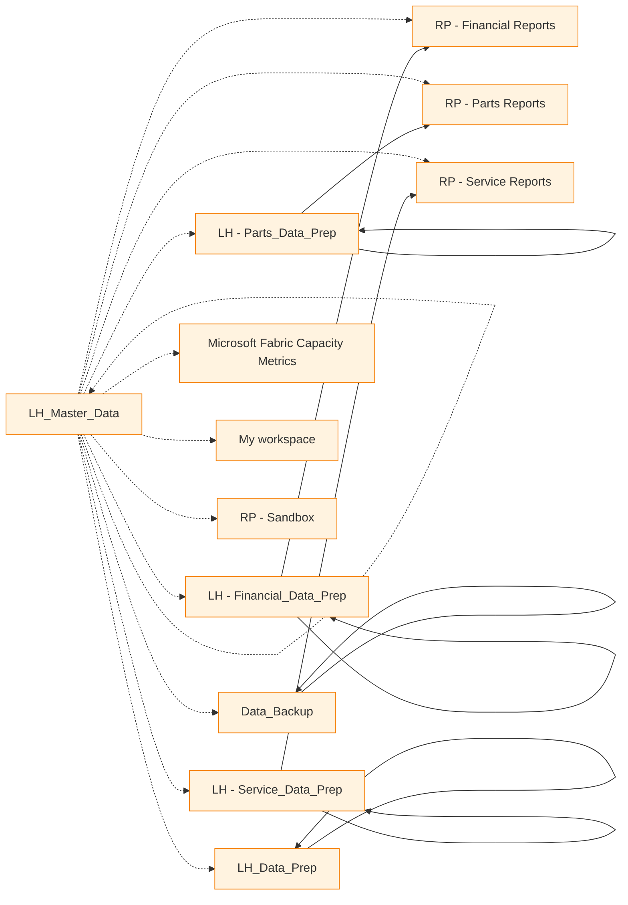

# Fabric Item Dependency Report

**Generated:** 2025-10-21 09:12:35
**Purpose:** Shows which reports use which data sources and where they're located

---

## Executive Summary

| Metric | Count |
|--------|-------|
| Total Workspaces | 13 |
| Reporting Workspaces | 12 |
| Total Reports/Dashboards | 91 |
| Data Preparation Workspaces | 6 |

---

## Detailed Workspace Analysis

### Data_Backup

**Total Items:** 3

#### LH_Data_Backup

- **Type:** SemanticModel
- **ID:** `aa0b74bf-0689-4b3f-bf3b-bca1f37d5cdb`
- **Likely Data Sources:**
  - **StagingWarehouseForDataflows_20250428141043** (Warehouse) in *Data_Backup*
  - **LH_Data_Backup** (Lakehouse) in *Data_Backup*
  - **DF_Equip_Backup** (Dataflow) in *Data_Backup*
  - **StagingLakehouseForDataflows_20250428141021** (Lakehouse) in *Data_Backup*

#### StagingLakehouseForDataflows_20250428141021

- **Type:** SemanticModel
- **ID:** `4eae4cad-8899-4535-b73c-35b64046d1b3`
- **Likely Data Sources:**
  - **StagingWarehouseForDataflows_20250428141043** (Warehouse) in *Data_Backup*
  - **LH_Data_Backup** (Lakehouse) in *Data_Backup*
  - **DF_Equip_Backup** (Dataflow) in *Data_Backup*
  - **StagingLakehouseForDataflows_20250428141021** (Lakehouse) in *Data_Backup*

#### StagingWarehouseForDataflows_20250428141043

- **Type:** SemanticModel
- **ID:** `faa4ccb2-0e7f-4be0-947a-df0c417ced54`
- **Likely Data Sources:**
  - **StagingWarehouseForDataflows_20250428141043** (Warehouse) in *Data_Backup*
  - **LH_Data_Backup** (Lakehouse) in *Data_Backup*
  - **DF_Equip_Backup** (Dataflow) in *Data_Backup*
  - **StagingLakehouseForDataflows_20250428141021** (Lakehouse) in *Data_Backup*

---

### LH - Financial_Data_Prep

**Total Items:** 3

#### LH_Financial_Report_Data

- **Type:** SemanticModel
- **ID:** `071a032e-91f9-41de-9069-3eb1de27975b`
- **Likely Data Sources:**
  - **DF_ArMaster_Financial_copy1** (Dataflow) in *LH - Financial_Data_Prep*
  - **StagingWarehouseForDataflows_20251009201858** (Warehouse) in *LH - Financial_Data_Prep*
  - **DF_Invoiced_Payroll_copy1** (Dataflow) in *LH - Financial_Data_Prep*
  - **StagingLakehouseForDataflows_20251009201845** (Lakehouse) in *LH - Financial_Data_Prep*
  - **DataflowsStagingLakehouse1** (Lakehouse) in *LH - Financial_Data_Prep*

#### DataflowsStagingLakehouse1

- **Type:** SemanticModel
- **ID:** `d8862875-5d09-4962-aa32-5114b84b39b3`
- **Likely Data Sources:**
  - **DF_ArMaster_Financial_copy1** (Dataflow) in *LH - Financial_Data_Prep*
  - **StagingWarehouseForDataflows_20251009201858** (Warehouse) in *LH - Financial_Data_Prep*
  - **DF_Invoiced_Payroll_copy1** (Dataflow) in *LH - Financial_Data_Prep*
  - **StagingLakehouseForDataflows_20251009201845** (Lakehouse) in *LH - Financial_Data_Prep*
  - **DataflowsStagingLakehouse1** (Lakehouse) in *LH - Financial_Data_Prep*

#### DataflowsStagingWarehouse

- **Type:** SemanticModel
- **ID:** `9214d428-2673-488b-916f-c9b5de263d3d`
- **Likely Data Sources:**
  - **DF_ArMaster_Financial_copy1** (Dataflow) in *LH - Financial_Data_Prep*
  - **StagingWarehouseForDataflows_20251009201858** (Warehouse) in *LH - Financial_Data_Prep*
  - **DF_Invoiced_Payroll_copy1** (Dataflow) in *LH - Financial_Data_Prep*
  - **StagingLakehouseForDataflows_20251009201845** (Lakehouse) in *LH - Financial_Data_Prep*
  - **DataflowsStagingLakehouse1** (Lakehouse) in *LH - Financial_Data_Prep*

---

### LH - Parts_Data_Prep

**Total Items:** 4

#### LH_Parts_Reports_Data

- **Type:** SemanticModel
- **ID:** `a9c4c62c-8216-4f7d-8014-f38eb4519905`
- **Likely Data Sources:**
  - **DataflowsStagingLakehouse** (Lakehouse) in *LH - Parts_Data_Prep*
  - **LH_Parts_Reports_Data** (Lakehouse) in *LH - Parts_Data_Prep*
  - **DataflowsStagingWarehouse** (Warehouse) in *LH - Parts_Data_Prep*

#### DataflowsStagingWarehouse

- **Type:** SemanticModel
- **ID:** `25a7c524-a817-4074-b600-22581bdc239d`
- **Likely Data Sources:**
  - **DataflowsStagingLakehouse** (Lakehouse) in *LH - Parts_Data_Prep*
  - **LH_Parts_Reports_Data** (Lakehouse) in *LH - Parts_Data_Prep*
  - **DataflowsStagingWarehouse** (Warehouse) in *LH - Parts_Data_Prep*

#### DataflowsStagingLakehouse

- **Type:** SemanticModel
- **ID:** `164b84d7-b7b1-4ac5-9dca-cd82d8405837`
- **Likely Data Sources:**
  - **DataflowsStagingLakehouse** (Lakehouse) in *LH - Parts_Data_Prep*
  - **LH_Parts_Reports_Data** (Lakehouse) in *LH - Parts_Data_Prep*
  - **DataflowsStagingWarehouse** (Warehouse) in *LH - Parts_Data_Prep*

#### Parts On Open Work Orders

- **Type:** SemanticModel
- **ID:** `2269f61d-18e6-4cf6-85b6-9f9b41adc5d9`
- **Likely Data Sources:**
  - **DataflowsStagingLakehouse** (Lakehouse) in *LH - Parts_Data_Prep*
  - **LH_Parts_Reports_Data** (Lakehouse) in *LH - Parts_Data_Prep*
  - **DataflowsStagingWarehouse** (Warehouse) in *LH - Parts_Data_Prep*

---

### LH - Service_Data_Prep

**Total Items:** 6

#### LH_Service_Reports_Data

- **Type:** SemanticModel
- **ID:** `4e53cbe6-ef85-4ff8-b631-a642c44e1443`
- **Likely Data Sources:**
  - **StagingWarehouseForDataflows** (Warehouse) in *LH - Service_Data_Prep*
  - **StagingLakehouseForDataflows** (Lakehouse) in *LH - Service_Data_Prep*
  - **DataflowsStagingWarehouse** (Warehouse) in *LH - Service_Data_Prep*
  - **LH_Service_Reports_Data** (Lakehouse) in *LH - Service_Data_Prep*
  - **DF_WIP_Report** (Dataflow) in *LH - Service_Data_Prep*

#### DataflowsStagingLakehouse

- **Type:** SemanticModel
- **ID:** `dc75206e-1152-4a4d-b5f8-d6ce42ef26d5`
- **Likely Data Sources:**
  - **StagingWarehouseForDataflows** (Warehouse) in *LH - Service_Data_Prep*
  - **StagingLakehouseForDataflows** (Lakehouse) in *LH - Service_Data_Prep*
  - **DataflowsStagingWarehouse** (Warehouse) in *LH - Service_Data_Prep*
  - **LH_Service_Reports_Data** (Lakehouse) in *LH - Service_Data_Prep*
  - **DF_WIP_Report** (Dataflow) in *LH - Service_Data_Prep*

#### DataflowsStagingWarehouse

- **Type:** SemanticModel
- **ID:** `77264fce-428a-4b7b-806e-c2f1f7729ed3`
- **Likely Data Sources:**
  - **StagingWarehouseForDataflows** (Warehouse) in *LH - Service_Data_Prep*
  - **StagingLakehouseForDataflows** (Lakehouse) in *LH - Service_Data_Prep*
  - **DataflowsStagingWarehouse** (Warehouse) in *LH - Service_Data_Prep*
  - **LH_Service_Reports_Data** (Lakehouse) in *LH - Service_Data_Prep*
  - **DF_WIP_Report** (Dataflow) in *LH - Service_Data_Prep*

#### StagingLakehouseForDataflows

- **Type:** SemanticModel
- **ID:** `0f57376f-a323-4b2f-b7a6-99c024a0b1b5`
- **Likely Data Sources:**
  - **StagingWarehouseForDataflows** (Warehouse) in *LH - Service_Data_Prep*
  - **StagingLakehouseForDataflows** (Lakehouse) in *LH - Service_Data_Prep*
  - **DataflowsStagingWarehouse** (Warehouse) in *LH - Service_Data_Prep*
  - **LH_Service_Reports_Data** (Lakehouse) in *LH - Service_Data_Prep*
  - **DF_WIP_Report** (Dataflow) in *LH - Service_Data_Prep*

#### StagingWarehouseForDataflows

- **Type:** SemanticModel
- **ID:** `5cfedbba-2a92-4c5e-aa93-4c414f948ea9`
- **Likely Data Sources:**
  - **StagingWarehouseForDataflows** (Warehouse) in *LH - Service_Data_Prep*
  - **StagingLakehouseForDataflows** (Lakehouse) in *LH - Service_Data_Prep*
  - **DataflowsStagingWarehouse** (Warehouse) in *LH - Service_Data_Prep*
  - **LH_Service_Reports_Data** (Lakehouse) in *LH - Service_Data_Prep*
  - **DF_WIP_Report** (Dataflow) in *LH - Service_Data_Prep*

#### StagingWarehouseForDataflows_20250809110006

- **Type:** SemanticModel
- **ID:** `640df0c2-d0d8-4d83-901d-e38703da1886`
- **Likely Data Sources:**
  - **StagingWarehouseForDataflows** (Warehouse) in *LH - Service_Data_Prep*
  - **StagingLakehouseForDataflows** (Lakehouse) in *LH - Service_Data_Prep*
  - **DataflowsStagingWarehouse** (Warehouse) in *LH - Service_Data_Prep*
  - **LH_Service_Reports_Data** (Lakehouse) in *LH - Service_Data_Prep*
  - **DF_WIP_Report** (Dataflow) in *LH - Service_Data_Prep*

---

### LH_Data_Prep

**Total Items:** 6

#### LH_Data_Prep

- **Type:** SemanticModel
- **ID:** `ab3cfee3-8bd9-4d64-8446-e392e16217ed`
- **Likely Data Sources:**
  - **DataflowsStagingLakehouse** (Lakehouse) in *LH_Data_Prep*
  - **DataflowsStagingWarehouse** (Warehouse) in *LH_Data_Prep*
  - **StagingWarehouseForDataflows_20250423142610** (Warehouse) in *LH_Data_Prep*
  - **LH_Data_Prep** (Lakehouse) in *LH_Data_Prep*
  - **Test Warehouse** (Warehouse) in *LH_Data_Prep*

#### StagingLakehouseForDataflows_20250423142530

- **Type:** SemanticModel
- **ID:** `0f4c7463-091c-4fa5-9ea1-b182c0779d58`
- **Likely Data Sources:**
  - **DataflowsStagingLakehouse** (Lakehouse) in *LH_Data_Prep*
  - **DataflowsStagingWarehouse** (Warehouse) in *LH_Data_Prep*
  - **StagingWarehouseForDataflows_20250423142610** (Warehouse) in *LH_Data_Prep*
  - **LH_Data_Prep** (Lakehouse) in *LH_Data_Prep*
  - **Test Warehouse** (Warehouse) in *LH_Data_Prep*

#### StagingWarehouseForDataflows_20250423142610

- **Type:** SemanticModel
- **ID:** `b5025d73-e70c-400a-b77e-9b1398610933`
- **Likely Data Sources:**
  - **DataflowsStagingLakehouse** (Lakehouse) in *LH_Data_Prep*
  - **DataflowsStagingWarehouse** (Warehouse) in *LH_Data_Prep*
  - **StagingWarehouseForDataflows_20250423142610** (Warehouse) in *LH_Data_Prep*
  - **LH_Data_Prep** (Lakehouse) in *LH_Data_Prep*
  - **Test Warehouse** (Warehouse) in *LH_Data_Prep*

#### DataflowsStagingLakehouse

- **Type:** SemanticModel
- **ID:** `6186e26c-4948-4d28-a961-53b09b5a7a21`
- **Likely Data Sources:**
  - **DataflowsStagingLakehouse** (Lakehouse) in *LH_Data_Prep*
  - **DataflowsStagingWarehouse** (Warehouse) in *LH_Data_Prep*
  - **StagingWarehouseForDataflows_20250423142610** (Warehouse) in *LH_Data_Prep*
  - **LH_Data_Prep** (Lakehouse) in *LH_Data_Prep*
  - **Test Warehouse** (Warehouse) in *LH_Data_Prep*

#### DataflowsStagingWarehouse

- **Type:** SemanticModel
- **ID:** `2191db91-0bb4-435a-ad43-acb9d05d8a4b`
- **Likely Data Sources:**
  - **DataflowsStagingLakehouse** (Lakehouse) in *LH_Data_Prep*
  - **DataflowsStagingWarehouse** (Warehouse) in *LH_Data_Prep*
  - **StagingWarehouseForDataflows_20250423142610** (Warehouse) in *LH_Data_Prep*
  - **LH_Data_Prep** (Lakehouse) in *LH_Data_Prep*
  - **Test Warehouse** (Warehouse) in *LH_Data_Prep*

#### Test Warehouse

- **Type:** SemanticModel
- **ID:** `1e4625c3-3102-4bc3-8cc6-22f0fa2ae2bb`
- **Likely Data Sources:**
  - **DataflowsStagingLakehouse** (Lakehouse) in *LH_Data_Prep*
  - **DataflowsStagingWarehouse** (Warehouse) in *LH_Data_Prep*
  - **StagingWarehouseForDataflows_20250423142610** (Warehouse) in *LH_Data_Prep*
  - **LH_Data_Prep** (Lakehouse) in *LH_Data_Prep*
  - **Test Warehouse** (Warehouse) in *LH_Data_Prep*

---

### LH_Master_Data

**Total Items:** 5

#### LH_Master_Data

- **Type:** SemanticModel
- **ID:** `fc0b0952-b345-409f-9776-9c2a7dea594b`
- **Likely Data Sources:**
  - **df_Fact_WorkOrderHeader** (Dataflow) in *LH_Master_Data*
  - **df_TechnicianPunchedDetail_Raw** (Dataflow) in *LH_Master_Data*
  - **df_CustomerAnatomy** (Dataflow) in *LH_Master_Data*
  - **df_Fact_CustomerPerformance** (Dataflow) in *LH_Master_Data*
  - **df_Fact_WorkOrderLabor** (Dataflow) in *LH_Master_Data*

#### StagingLakehouseForDataflows_20250519175627

- **Type:** SemanticModel
- **ID:** `bb461e9e-af86-407c-8d14-92975d5a7cda`
- **Likely Data Sources:**
  - **df_Fact_WorkOrderHeader** (Dataflow) in *LH_Master_Data*
  - **df_TechnicianPunchedDetail_Raw** (Dataflow) in *LH_Master_Data*
  - **df_CustomerAnatomy** (Dataflow) in *LH_Master_Data*
  - **df_Fact_CustomerPerformance** (Dataflow) in *LH_Master_Data*
  - **df_Fact_WorkOrderLabor** (Dataflow) in *LH_Master_Data*

#### StagingWarehouseForDataflows_20250519175650

- **Type:** SemanticModel
- **ID:** `d1c3f6d0-572d-4461-89ee-1d219009edc8`
- **Likely Data Sources:**
  - **df_Fact_WorkOrderHeader** (Dataflow) in *LH_Master_Data*
  - **df_TechnicianPunchedDetail_Raw** (Dataflow) in *LH_Master_Data*
  - **df_CustomerAnatomy** (Dataflow) in *LH_Master_Data*
  - **df_Fact_CustomerPerformance** (Dataflow) in *LH_Master_Data*
  - **df_Fact_WorkOrderLabor** (Dataflow) in *LH_Master_Data*

#### Inventory Analysis

- **Type:** SemanticModel
- **ID:** `9afd3b3d-53db-473d-879c-9c20167b9532`
- **Likely Data Sources:**
  - **df_Fact_WorkOrderHeader** (Dataflow) in *LH_Master_Data*
  - **df_TechnicianPunchedDetail_Raw** (Dataflow) in *LH_Master_Data*
  - **df_CustomerAnatomy** (Dataflow) in *LH_Master_Data*
  - **df_Fact_CustomerPerformance** (Dataflow) in *LH_Master_Data*
  - **df_Fact_WorkOrderLabor** (Dataflow) in *LH_Master_Data*

#### TopJobCode_Analysis_Model

- **Type:** SemanticModel
- **ID:** `a746d96c-07b3-4cd7-9b7d-36d347c449b7`
- **Likely Data Sources:**
  - **df_Fact_WorkOrderHeader** (Dataflow) in *LH_Master_Data*
  - **df_TechnicianPunchedDetail_Raw** (Dataflow) in *LH_Master_Data*
  - **df_CustomerAnatomy** (Dataflow) in *LH_Master_Data*
  - **df_Fact_CustomerPerformance** (Dataflow) in *LH_Master_Data*
  - **df_Fact_WorkOrderLabor** (Dataflow) in *LH_Master_Data*

---

### Microsoft Fabric Capacity Metrics

**Total Items:** 2

#### Fabric Capacity Metrics

- **Type:** Report
- **ID:** `2e0878c2-2051-4a6b-98ea-607ebb1263a3`
- **Possible Data Sources:**
  - **df_Fact_WorkOrderHeader** (Dataflow) in *LH_Master_Data*

#### Fabric Capacity Metrics

- **Type:** SemanticModel
- **ID:** `235b264c-203b-4425-9686-94589a67127a`
- **Possible Data Sources:**
  - **df_Fact_WorkOrderHeader** (Dataflow) in *LH_Master_Data*

---

### My workspace

**Total Items:** 10

#### Report Refresh Schedule

- **Type:** Report
- **ID:** `fbe8d1cc-07a5-484d-be12-0564a1e2b332`
- **Likely Data Sources:**
  - **DataflowsStagingLakehouse** (Lakehouse) in *My workspace*
  - **DataflowsStagingWarehouse** (Warehouse) in *My workspace*
  - **DataflowsStagingLakehouse** (Lakehouse) in *My workspace*
  - **DataflowsStagingWarehouse** (Warehouse) in *My workspace*

#### Parts Sales with Low Margins

- **Type:** Report
- **ID:** `50ab7218-3bfe-43d6-a323-445e8d49d9b4`
- **Likely Data Sources:**
  - **DataflowsStagingLakehouse** (Lakehouse) in *My workspace*
  - **DataflowsStagingWarehouse** (Warehouse) in *My workspace*
  - **DataflowsStagingLakehouse** (Lakehouse) in *My workspace*
  - **DataflowsStagingWarehouse** (Warehouse) in *My workspace*

#### Parts Adjustments - V2

- **Type:** Report
- **ID:** `d142746b-9431-48de-ba3b-3ddb8b135e7a`
- **Likely Data Sources:**
  - **DataflowsStagingLakehouse** (Lakehouse) in *My workspace*
  - **DataflowsStagingWarehouse** (Warehouse) in *My workspace*
  - **DataflowsStagingLakehouse** (Lakehouse) in *My workspace*
  - **DataflowsStagingWarehouse** (Warehouse) in *My workspace*

#### Report Refresh Schedule

- **Type:** SemanticModel
- **ID:** `9aadc4cd-7798-46ff-bca2-b1c776d96b97`
- **Likely Data Sources:**
  - **DataflowsStagingLakehouse** (Lakehouse) in *My workspace*
  - **DataflowsStagingWarehouse** (Warehouse) in *My workspace*
  - **DataflowsStagingLakehouse** (Lakehouse) in *My workspace*
  - **DataflowsStagingWarehouse** (Warehouse) in *My workspace*

#### Combine Vault Transfers

- **Type:** SemanticModel
- **ID:** `e11fa6f1-2fb1-44e0-9020-b321ea6baeda`
- **Likely Data Sources:**
  - **DataflowsStagingLakehouse** (Lakehouse) in *My workspace*
  - **DataflowsStagingWarehouse** (Warehouse) in *My workspace*

#### Parts Sales with Low Margins

- **Type:** SemanticModel
- **ID:** `416c8a4a-4967-41cd-b9f3-9a905d892a2f`
- **Likely Data Sources:**
  - **DataflowsStagingLakehouse** (Lakehouse) in *My workspace*
  - **DataflowsStagingWarehouse** (Warehouse) in *My workspace*
  - **DataflowsStagingLakehouse** (Lakehouse) in *My workspace*
  - **DataflowsStagingWarehouse** (Warehouse) in *My workspace*

#### Parts Adjustments - V2

- **Type:** SemanticModel
- **ID:** `32c93e49-e5f6-486b-b07c-1a9015d2c0e4`
- **Likely Data Sources:**
  - **DataflowsStagingLakehouse** (Lakehouse) in *My workspace*
  - **DataflowsStagingWarehouse** (Warehouse) in *My workspace*
  - **DataflowsStagingLakehouse** (Lakehouse) in *My workspace*
  - **DataflowsStagingWarehouse** (Warehouse) in *My workspace*

#### DataflowsStagingLakehouse

- **Type:** SemanticModel
- **ID:** `b967b002-817b-42fd-ba15-3ae8bd19ac14`
- **Likely Data Sources:**
  - **DataflowsStagingLakehouse** (Lakehouse) in *My workspace*
  - **DataflowsStagingWarehouse** (Warehouse) in *My workspace*

#### DataflowsStagingWarehouse

- **Type:** SemanticModel
- **ID:** `7789606c-f7e2-4abf-8d10-9c5b17c4c440`
- **Likely Data Sources:**
  - **DataflowsStagingLakehouse** (Lakehouse) in *My workspace*
  - **DataflowsStagingWarehouse** (Warehouse) in *My workspace*

#### Subscription_Data

- **Type:** SemanticModel
- **ID:** `6f14d545-3c83-4dbc-a4f3-207be5f5b36b`
- **Likely Data Sources:**
  - **DataflowsStagingLakehouse** (Lakehouse) in *My workspace*
  - **DataflowsStagingWarehouse** (Warehouse) in *My workspace*

---

### RP - Financial Reports

**Total Items:** 2

#### 60+ Days Past Due

- **Type:** Report
- **ID:** `0fc37fea-0230-46f9-9e41-410bf55c7bdd`
- **Likely Data Sources:**
  - **DF_ArMaster_Financial_copy1** (Dataflow) in *LH - Financial_Data_Prep*
  - **StagingWarehouseForDataflows_20251009201858** (Warehouse) in *LH - Financial_Data_Prep*
  - **DF_Invoiced_Payroll_copy1** (Dataflow) in *LH - Financial_Data_Prep*
  - **StagingLakehouseForDataflows_20251009201845** (Lakehouse) in *LH - Financial_Data_Prep*
  - **DataflowsStagingLakehouse1** (Lakehouse) in *LH - Financial_Data_Prep*

#### 60+ Days Past Due

- **Type:** SemanticModel
- **ID:** `caf32fca-2b2f-4ba1-b73c-ea7ddf8ab536`
- **Likely Data Sources:**
  - **DF_ArMaster_Financial_copy1** (Dataflow) in *LH - Financial_Data_Prep*
  - **StagingWarehouseForDataflows_20251009201858** (Warehouse) in *LH - Financial_Data_Prep*
  - **DF_Invoiced_Payroll_copy1** (Dataflow) in *LH - Financial_Data_Prep*
  - **StagingLakehouseForDataflows_20251009201845** (Lakehouse) in *LH - Financial_Data_Prep*
  - **DataflowsStagingLakehouse1** (Lakehouse) in *LH - Financial_Data_Prep*

---

### RP - Parts Reports

**Total Items:** 18

#### First Pass Fill

- **Type:** Report
- **ID:** `9ec77b5f-82a9-403e-a331-5a012c1884e2`
- **Likely Data Sources:**
  - **DataflowsStagingLakehouse** (Lakehouse) in *LH - Parts_Data_Prep*
  - **df_Dim_Branch12_Parts** (Dataflow) in *LH_Master_Data*
  - **df_Transform_Parts** (Dataflow) in *LH_Master_Data*
  - **LH_Parts_Reports_Data** (Lakehouse) in *LH - Parts_Data_Prep*
  - **df_Fact_WorkOrderParts** (Dataflow) in *LH_Master_Data*

#### Negative On Hand-On Hand No Bin

- **Type:** Report
- **ID:** `eeb5fb96-f536-4244-b580-276c07434ac6`
- **Likely Data Sources:**
  - **DataflowsStagingLakehouse** (Lakehouse) in *LH - Parts_Data_Prep*
  - **df_Dim_Branch12_Parts** (Dataflow) in *LH_Master_Data*
  - **df_Transform_Parts** (Dataflow) in *LH_Master_Data*
  - **LH_Parts_Reports_Data** (Lakehouse) in *LH - Parts_Data_Prep*
  - **df_Fact_WorkOrderParts** (Dataflow) in *LH_Master_Data*

#### Unique Parts Customers

- **Type:** Report
- **ID:** `2385aaf8-dfe2-4679-8231-9ff8aac0add6`
- **Likely Data Sources:**
  - **DataflowsStagingLakehouse** (Lakehouse) in *LH - Parts_Data_Prep*
  - **df_Dim_Branch12_Parts** (Dataflow) in *LH_Master_Data*
  - **df_Transform_Parts** (Dataflow) in *LH_Master_Data*
  - **LH_Parts_Reports_Data** (Lakehouse) in *LH - Parts_Data_Prep*
  - **df_Fact_WorkOrderParts** (Dataflow) in *LH_Master_Data*

#### Combine Vault Transfers

- **Type:** Report
- **ID:** `09164bc7-5726-4043-8c0b-886a3491e81c`
- **Likely Data Sources:**
  - **DataflowsStagingLakehouse** (Lakehouse) in *LH - Parts_Data_Prep*
  - **df_Dim_Branch12_Parts** (Dataflow) in *LH_Master_Data*
  - **df_Transform_Parts** (Dataflow) in *LH_Master_Data*
  - **LH_Parts_Reports_Data** (Lakehouse) in *LH - Parts_Data_Prep*
  - **df_Fact_WorkOrderParts** (Dataflow) in *LH_Master_Data*

#### Parts Sales with Low Margins

- **Type:** Report
- **ID:** `db9b084f-b4bb-46c2-b2b7-ad7b3274beea`
- **Likely Data Sources:**
  - **DataflowsStagingLakehouse** (Lakehouse) in *LH - Parts_Data_Prep*
  - **df_Dim_Branch12_Parts** (Dataflow) in *LH_Master_Data*
  - **df_Transform_Parts** (Dataflow) in *LH_Master_Data*
  - **LH_Parts_Reports_Data** (Lakehouse) in *LH - Parts_Data_Prep*
  - **df_Fact_WorkOrderParts** (Dataflow) in *LH_Master_Data*

#### Physical Inventory

- **Type:** Report
- **ID:** `adcea6a5-2062-4caf-8296-d1627e5963bf`
- **Likely Data Sources:**
  - **DataflowsStagingLakehouse** (Lakehouse) in *LH - Parts_Data_Prep*
  - **df_Dim_Branch12_Parts** (Dataflow) in *LH_Master_Data*
  - **df_Transform_Parts** (Dataflow) in *LH_Master_Data*
  - **LH_Parts_Reports_Data** (Lakehouse) in *LH - Parts_Data_Prep*
  - **df_Fact_WorkOrderParts** (Dataflow) in *LH_Master_Data*

#### Parts Adjustments

- **Type:** Report
- **ID:** `e2f669b5-b4cf-4ba8-a53c-192b6d4136d6`
- **Likely Data Sources:**
  - **DataflowsStagingLakehouse** (Lakehouse) in *LH - Parts_Data_Prep*
  - **df_Dim_Branch12_Parts** (Dataflow) in *LH_Master_Data*
  - **df_Transform_Parts** (Dataflow) in *LH_Master_Data*
  - **LH_Parts_Reports_Data** (Lakehouse) in *LH - Parts_Data_Prep*
  - **df_Fact_WorkOrderParts** (Dataflow) in *LH_Master_Data*

#### Parts with Open Orders

- **Type:** Report
- **ID:** `8a5f7584-8f27-4e4f-91d0-2f566d875b83`
- **Likely Data Sources:**
  - **DataflowsStagingLakehouse** (Lakehouse) in *LH - Parts_Data_Prep*
  - **df_Dim_Branch12_Parts** (Dataflow) in *LH_Master_Data*
  - **df_Transform_Parts** (Dataflow) in *LH_Master_Data*
  - **LH_Parts_Reports_Data** (Lakehouse) in *LH - Parts_Data_Prep*
  - **df_Fact_WorkOrderParts** (Dataflow) in *LH_Master_Data*

#### Bin Location Report

- **Type:** Report
- **ID:** `eae918c0-964d-472a-921d-71764d9ab72b`
- **Likely Data Sources:**
  - **DataflowsStagingLakehouse** (Lakehouse) in *LH - Parts_Data_Prep*
  - **df_Dim_Branch12_Parts** (Dataflow) in *LH_Master_Data*
  - **df_Transform_Parts** (Dataflow) in *LH_Master_Data*
  - **LH_Parts_Reports_Data** (Lakehouse) in *LH - Parts_Data_Prep*
  - **df_Fact_WorkOrderParts** (Dataflow) in *LH_Master_Data*

#### First Pass Fill

- **Type:** SemanticModel
- **ID:** `c346e9ed-fcc0-41e4-bca5-78ea8698f444`
- **Likely Data Sources:**
  - **DataflowsStagingLakehouse** (Lakehouse) in *LH - Parts_Data_Prep*
  - **df_Dim_Branch12_Parts** (Dataflow) in *LH_Master_Data*
  - **df_Transform_Parts** (Dataflow) in *LH_Master_Data*
  - **LH_Parts_Reports_Data** (Lakehouse) in *LH - Parts_Data_Prep*
  - **df_Fact_WorkOrderParts** (Dataflow) in *LH_Master_Data*

#### Negative On Hand-On Hand No Bin

- **Type:** SemanticModel
- **ID:** `28a91b94-f27a-47fd-81ea-49220f1c8b2c`
- **Likely Data Sources:**
  - **DataflowsStagingLakehouse** (Lakehouse) in *LH - Parts_Data_Prep*
  - **df_Dim_Branch12_Parts** (Dataflow) in *LH_Master_Data*
  - **df_Transform_Parts** (Dataflow) in *LH_Master_Data*
  - **LH_Parts_Reports_Data** (Lakehouse) in *LH - Parts_Data_Prep*
  - **df_Fact_WorkOrderParts** (Dataflow) in *LH_Master_Data*

#### Unique Parts Customers

- **Type:** SemanticModel
- **ID:** `b4c692e2-fd47-405c-b882-ed30ef75d017`
- **Likely Data Sources:**
  - **DataflowsStagingLakehouse** (Lakehouse) in *LH - Parts_Data_Prep*
  - **df_Dim_Branch12_Parts** (Dataflow) in *LH_Master_Data*
  - **df_Transform_Parts** (Dataflow) in *LH_Master_Data*
  - **LH_Parts_Reports_Data** (Lakehouse) in *LH - Parts_Data_Prep*
  - **df_Fact_WorkOrderParts** (Dataflow) in *LH_Master_Data*

#### Combine Vault Transfers

- **Type:** SemanticModel
- **ID:** `029e5a98-7a02-4c5a-bb67-9204082de574`
- **Likely Data Sources:**
  - **DataflowsStagingLakehouse** (Lakehouse) in *LH - Parts_Data_Prep*
  - **df_Dim_Branch12_Parts** (Dataflow) in *LH_Master_Data*
  - **df_Transform_Parts** (Dataflow) in *LH_Master_Data*
  - **LH_Parts_Reports_Data** (Lakehouse) in *LH - Parts_Data_Prep*
  - **df_Fact_WorkOrderParts** (Dataflow) in *LH_Master_Data*

#### Parts Sales with Low Margins

- **Type:** SemanticModel
- **ID:** `4a796a13-8944-49ed-80d6-7f1df0b9f397`
- **Likely Data Sources:**
  - **DataflowsStagingLakehouse** (Lakehouse) in *LH - Parts_Data_Prep*
  - **df_Dim_Branch12_Parts** (Dataflow) in *LH_Master_Data*
  - **df_Transform_Parts** (Dataflow) in *LH_Master_Data*
  - **LH_Parts_Reports_Data** (Lakehouse) in *LH - Parts_Data_Prep*
  - **df_Fact_WorkOrderParts** (Dataflow) in *LH_Master_Data*

#### Physical Inventory

- **Type:** SemanticModel
- **ID:** `2ea36972-5683-4819-bfed-e57deb84391f`
- **Likely Data Sources:**
  - **DataflowsStagingLakehouse** (Lakehouse) in *LH - Parts_Data_Prep*
  - **df_Dim_Branch12_Parts** (Dataflow) in *LH_Master_Data*
  - **df_Transform_Parts** (Dataflow) in *LH_Master_Data*
  - **LH_Parts_Reports_Data** (Lakehouse) in *LH - Parts_Data_Prep*
  - **df_Fact_WorkOrderParts** (Dataflow) in *LH_Master_Data*

#### Parts Adjustments

- **Type:** SemanticModel
- **ID:** `d4e16301-35e2-4fe2-932c-d97fd92c3828`
- **Likely Data Sources:**
  - **DataflowsStagingLakehouse** (Lakehouse) in *LH - Parts_Data_Prep*
  - **df_Dim_Branch12_Parts** (Dataflow) in *LH_Master_Data*
  - **df_Transform_Parts** (Dataflow) in *LH_Master_Data*
  - **LH_Parts_Reports_Data** (Lakehouse) in *LH - Parts_Data_Prep*
  - **df_Fact_WorkOrderParts** (Dataflow) in *LH_Master_Data*

#### Parts with Open Orders

- **Type:** SemanticModel
- **ID:** `65ba8478-74b3-4fe0-b330-3fda0e4eec29`
- **Likely Data Sources:**
  - **DataflowsStagingLakehouse** (Lakehouse) in *LH - Parts_Data_Prep*
  - **df_Dim_Branch12_Parts** (Dataflow) in *LH_Master_Data*
  - **df_Transform_Parts** (Dataflow) in *LH_Master_Data*
  - **LH_Parts_Reports_Data** (Lakehouse) in *LH - Parts_Data_Prep*
  - **df_Fact_WorkOrderParts** (Dataflow) in *LH_Master_Data*

#### Bin Location Report

- **Type:** SemanticModel
- **ID:** `28cced68-a852-412b-befd-d41d8118a2ea`
- **Likely Data Sources:**
  - **DataflowsStagingLakehouse** (Lakehouse) in *LH - Parts_Data_Prep*
  - **df_Dim_Branch12_Parts** (Dataflow) in *LH_Master_Data*
  - **df_Transform_Parts** (Dataflow) in *LH_Master_Data*
  - **LH_Parts_Reports_Data** (Lakehouse) in *LH - Parts_Data_Prep*
  - **df_Fact_WorkOrderParts** (Dataflow) in *LH_Master_Data*

---

### RP - Sandbox

**Total Items:** 24

#### WIP

- **Type:** Report
- **ID:** `125c4dc7-af84-41e7-ad5d-b27a9268b3fd`
- **Possible Data Sources:**
  - **df_Fact_WorkOrderHeader** (Dataflow) in *LH_Master_Data*

#### Table and Column Names

- **Type:** Report
- **ID:** `18e162c6-f7b2-4f29-9e7e-1b70da054cb0`
- **Possible Data Sources:**
  - **df_Fact_WorkOrderHeader** (Dataflow) in *LH_Master_Data*

#### Parts Promo V2

- **Type:** Report
- **ID:** `167ea352-7fa8-4755-993f-fd22a3f8c47a`
- **Possible Data Sources:**
  - **df_Fact_WorkOrderHeader** (Dataflow) in *LH_Master_Data*

#### Customer Anatomy

- **Type:** Report
- **ID:** `a7fac85d-d465-46f1-9bf4-a11d705bb913`
- **Possible Data Sources:**
  - **df_Fact_WorkOrderHeader** (Dataflow) in *LH_Master_Data*

#### Key Customers

- **Type:** Report
- **ID:** `0acb20d9-ebff-4af8-b340-4d7584be2884`
- **Possible Data Sources:**
  - **df_Fact_WorkOrderHeader** (Dataflow) in *LH_Master_Data*

#### Inventory Analysis V3

- **Type:** Report
- **ID:** `832d4074-6877-43aa-b3b7-0ec6a732cf4c`
- **Possible Data Sources:**
  - **df_Fact_WorkOrderHeader** (Dataflow) in *LH_Master_Data*

#### Price Matrix V2

- **Type:** Report
- **ID:** `1b4a79d4-c8f7-4405-aaab-710394c02f59`
- **Possible Data Sources:**
  - **df_Fact_WorkOrderHeader** (Dataflow) in *LH_Master_Data*

#### Unique Parts Customers V2

- **Type:** Report
- **ID:** `7595e994-f8f5-4b54-94ee-39adf33467d7`
- **Possible Data Sources:**
  - **df_Fact_WorkOrderHeader** (Dataflow) in *LH_Master_Data*

#### Sparc Inventory Health

- **Type:** Report
- **ID:** `d5c8e132-c850-47a3-aece-3483938b9392`
- **Possible Data Sources:**
  - **df_Fact_WorkOrderHeader** (Dataflow) in *LH_Master_Data*

#### First Pass Fill V2

- **Type:** Report
- **ID:** `1d08824b-a402-4508-a84a-e55f5b52782a`
- **Possible Data Sources:**
  - **df_Fact_WorkOrderHeader** (Dataflow) in *LH_Master_Data*

#### Top 50 - Job Codes

- **Type:** Report
- **ID:** `bdb39d93-8033-4c6c-bbb3-086e73d3ccca`
- **Possible Data Sources:**
  - **df_Fact_WorkOrderHeader** (Dataflow) in *LH_Master_Data*

#### Combine Vault Sales

- **Type:** Report
- **ID:** `62b52967-05de-4549-b8ae-860d8220d6da`
- **Possible Data Sources:**
  - **df_Fact_WorkOrderHeader** (Dataflow) in *LH_Master_Data*

#### WIP

- **Type:** SemanticModel
- **ID:** `163190d1-79cd-4991-948b-27efe4e523a2`
- **Possible Data Sources:**
  - **df_Fact_WorkOrderHeader** (Dataflow) in *LH_Master_Data*

#### Table and Column Names

- **Type:** SemanticModel
- **ID:** `02d3d0fb-a89d-4037-9906-d12cfe1d93e9`
- **Possible Data Sources:**
  - **df_Fact_WorkOrderHeader** (Dataflow) in *LH_Master_Data*

#### Parts Promo V2

- **Type:** SemanticModel
- **ID:** `e61d76ef-1895-4c5c-8cdc-19bd5ef55caf`
- **Possible Data Sources:**
  - **df_Fact_WorkOrderHeader** (Dataflow) in *LH_Master_Data*

#### Customer Anatomy

- **Type:** SemanticModel
- **ID:** `fe03bc2a-b677-4ced-b6aa-4c286036f3f5`
- **Possible Data Sources:**
  - **df_Fact_WorkOrderHeader** (Dataflow) in *LH_Master_Data*

#### Key Customers

- **Type:** SemanticModel
- **ID:** `9ce55dcf-1dbd-40b1-b8c3-ce150797e0a5`
- **Possible Data Sources:**
  - **df_Fact_WorkOrderHeader** (Dataflow) in *LH_Master_Data*

#### Inventory Analysis V3

- **Type:** SemanticModel
- **ID:** `7276f492-09bf-4177-8cd7-d36f613693f8`
- **Possible Data Sources:**
  - **df_Fact_WorkOrderHeader** (Dataflow) in *LH_Master_Data*

#### Price Matrix V2

- **Type:** SemanticModel
- **ID:** `bdecebfa-be8a-4cb6-8fa0-554316c8a1c9`
- **Possible Data Sources:**
  - **df_Fact_WorkOrderHeader** (Dataflow) in *LH_Master_Data*

#### Unique Parts Customers V2

- **Type:** SemanticModel
- **ID:** `4db20f79-5fe8-4fa4-a88e-1ff403e769dc`
- **Possible Data Sources:**
  - **df_Fact_WorkOrderHeader** (Dataflow) in *LH_Master_Data*

#### Sparc Inventory Health

- **Type:** SemanticModel
- **ID:** `dbf4b95f-023c-422d-a8bf-74b589af915f`
- **Possible Data Sources:**
  - **df_Fact_WorkOrderHeader** (Dataflow) in *LH_Master_Data*

#### First Pass Fill V2

- **Type:** SemanticModel
- **ID:** `d97c6f20-9d9c-41fa-8612-4a55ddc00362`
- **Possible Data Sources:**
  - **df_Fact_WorkOrderHeader** (Dataflow) in *LH_Master_Data*

#### Top 50 - Job Codes

- **Type:** SemanticModel
- **ID:** `3c0175ed-0fa6-4ad9-bdd7-acf3a1d3baa2`
- **Possible Data Sources:**
  - **df_Fact_WorkOrderHeader** (Dataflow) in *LH_Master_Data*

#### Combine Vault Sales

- **Type:** SemanticModel
- **ID:** `f55d44ea-c315-4391-ba7e-b273b807310c`
- **Possible Data Sources:**
  - **df_Fact_WorkOrderHeader** (Dataflow) in *LH_Master_Data*

---

### RP - Service Reports

**Total Items:** 8

#### Labor Performance

- **Type:** Report
- **ID:** `8e148845-dc64-4025-83f3-3bd9130989b1`
- **Likely Data Sources:**
  - **StagingWarehouseForDataflows** (Warehouse) in *LH - Service_Data_Prep*
  - **df_Fact_Machines_Serviced** (Dataflow) in *LH_Master_Data*
  - **Equipment Service - Data Quality Validation** (Dataflow) in *LH_Master_Data*
  - **StagingLakehouseForDataflows** (Lakehouse) in *LH - Service_Data_Prep*
  - **DataflowsStagingWarehouse** (Warehouse) in *LH - Service_Data_Prep*

#### Inspections

- **Type:** Report
- **ID:** `849253a9-23c3-4ab3-b075-c07e6243edaf`
- **Likely Data Sources:**
  - **StagingWarehouseForDataflows** (Warehouse) in *LH - Service_Data_Prep*
  - **df_Fact_Machines_Serviced** (Dataflow) in *LH_Master_Data*
  - **Equipment Service - Data Quality Validation** (Dataflow) in *LH_Master_Data*
  - **StagingLakehouseForDataflows** (Lakehouse) in *LH - Service_Data_Prep*
  - **DataflowsStagingWarehouse** (Warehouse) in *LH - Service_Data_Prep*

#### Open Work Orders

- **Type:** Report
- **ID:** `caa8e339-34be-4b91-8d70-95cd0d634adf`
- **Likely Data Sources:**
  - **StagingWarehouseForDataflows** (Warehouse) in *LH - Service_Data_Prep*
  - **df_Fact_Machines_Serviced** (Dataflow) in *LH_Master_Data*
  - **Equipment Service - Data Quality Validation** (Dataflow) in *LH_Master_Data*
  - **StagingLakehouseForDataflows** (Lakehouse) in *LH - Service_Data_Prep*
  - **DataflowsStagingWarehouse** (Warehouse) in *LH - Service_Data_Prep*

#### Planter Inspection Part Sales

- **Type:** Report
- **ID:** `b3a6f9ba-d084-4baa-94e3-85e2004e4a68`
- **Likely Data Sources:**
  - **StagingWarehouseForDataflows** (Warehouse) in *LH - Service_Data_Prep*
  - **df_Fact_Machines_Serviced** (Dataflow) in *LH_Master_Data*
  - **Equipment Service - Data Quality Validation** (Dataflow) in *LH_Master_Data*
  - **StagingLakehouseForDataflows** (Lakehouse) in *LH - Service_Data_Prep*
  - **DataflowsStagingWarehouse** (Warehouse) in *LH - Service_Data_Prep*

#### Labor Performance

- **Type:** SemanticModel
- **ID:** `79d11f0e-e3b7-4716-b2bd-480b29c9f910`
- **Likely Data Sources:**
  - **StagingWarehouseForDataflows** (Warehouse) in *LH - Service_Data_Prep*
  - **df_Fact_Machines_Serviced** (Dataflow) in *LH_Master_Data*
  - **Equipment Service - Data Quality Validation** (Dataflow) in *LH_Master_Data*
  - **StagingLakehouseForDataflows** (Lakehouse) in *LH - Service_Data_Prep*
  - **DataflowsStagingWarehouse** (Warehouse) in *LH - Service_Data_Prep*

#### Inspections

- **Type:** SemanticModel
- **ID:** `4a0705d0-4199-4c48-998d-537e86788b22`
- **Likely Data Sources:**
  - **StagingWarehouseForDataflows** (Warehouse) in *LH - Service_Data_Prep*
  - **df_Fact_Machines_Serviced** (Dataflow) in *LH_Master_Data*
  - **Equipment Service - Data Quality Validation** (Dataflow) in *LH_Master_Data*
  - **StagingLakehouseForDataflows** (Lakehouse) in *LH - Service_Data_Prep*
  - **DataflowsStagingWarehouse** (Warehouse) in *LH - Service_Data_Prep*

#### Open Work Orders

- **Type:** SemanticModel
- **ID:** `14d2bf14-0dac-45ce-91f2-cd62a6588c53`
- **Likely Data Sources:**
  - **StagingWarehouseForDataflows** (Warehouse) in *LH - Service_Data_Prep*
  - **df_Fact_Machines_Serviced** (Dataflow) in *LH_Master_Data*
  - **Equipment Service - Data Quality Validation** (Dataflow) in *LH_Master_Data*
  - **StagingLakehouseForDataflows** (Lakehouse) in *LH - Service_Data_Prep*
  - **DataflowsStagingWarehouse** (Warehouse) in *LH - Service_Data_Prep*

#### Planter Inspection Part Sales

- **Type:** SemanticModel
- **ID:** `3c336774-bfe1-422d-9231-2cb10c65a089`
- **Likely Data Sources:**
  - **StagingWarehouseForDataflows** (Warehouse) in *LH - Service_Data_Prep*
  - **df_Fact_Machines_Serviced** (Dataflow) in *LH_Master_Data*
  - **Equipment Service - Data Quality Validation** (Dataflow) in *LH_Master_Data*
  - **StagingLakehouseForDataflows** (Lakehouse) in *LH - Service_Data_Prep*
  - **DataflowsStagingWarehouse** (Warehouse) in *LH - Service_Data_Prep*

---

## Data Source Inventory

All potential data sources available across workspaces:

### My workspace

- **DataflowsStagingWarehouse** - Warehouse

### LH_Master_Data

- **df_Fact_InvoiceHeader** - Dataflow
- **df_Dim_Date** - Dataflow

### LH - Service_Data_Prep

- **DF_WIP_Report** - Dataflow

### LH_Data_Prep

- **StagingWarehouseForDataflows_20250423142610** - SemanticModel

### My workspace

- **DataflowsStagingLakehouse** - SemanticModel

### LH - Parts_Data_Prep

- **LH_Parts_Reports_Data** - Lakehouse

### RP - Sandbox

- **Combine Vault Sales** - SemanticModel

### LH_Master_Data

- **df_WKOTHSUB_Raw** - Dataflow
- **df_JDIS_PART_INFORMATION_Raw** - Dataflow
- **df_Fact_Inventory** - Dataflow

### RP - Sandbox

- **Table and Column Names** - SemanticModel

### LH_Master_Data

- **df_Dim_Franchise** - Dataflow

### LH_Data_Prep

- **StagingLakehouseForDataflows_20250423142530** - SemanticModel

### LH - Financial_Data_Prep

- **StagingLakehouseForDataflows_20251009201845** - Lakehouse

### Data_Backup

- **DF_Equip_Backup** - Dataflow

### LH - Parts_Data_Prep

- **DataflowsStagingWarehouse** - SemanticModel

### LH_Master_Data

- **df_INTRANS_Raw** - Dataflow
- **df_Fact_WorkOrderJobs** - Dataflow
- **df_WKVEHFL_Raw** - Dataflow
- **df_Dim_Customer** - Dataflow
- **LH_Master_Data** - SemanticModel

### RP - Sandbox

- **Top 50 - Job Codes** - SemanticModel

### LH_Master_Data

- **df_WKMECHWK_Raw** - Dataflow

### LH_Data_Prep

- **Test Warehouse** - SemanticModel

### RP - Parts Reports

- **First Pass Fill** - SemanticModel

### LH_Master_Data

- **df_VhStockAccess_Raw** - Dataflow

### My workspace

- **Parts Sales with Low Margins** - SemanticModel

### LH_Master_Data

- **df_Fact_LaborJobs** - Dataflow
- **df_Dim_JobCode** - Dataflow
- **df_Fact_Part_Transactions** - Dataflow

### RP - Parts Reports

- **Physical Inventory** - SemanticModel

### LH_Data_Prep

- **Test Warehouse** - Warehouse

### My workspace

- **Parts Adjustments - V2** - SemanticModel

### LH_Data_Prep

- **DataflowsStagingLakehouse** - SemanticModel

### RP - Service Reports

- **Labor Performance** - SemanticModel

### LH_Master_Data

- **df_WKINVREG_Raw** - Dataflow

### LH_Data_Prep

- **StagingLakehouseForDataflows_20250423142530** - Lakehouse

### LH_Master_Data

- **df_Fact_Top50_JobCodes** - Dataflow

### RP - Sandbox

- **Unique Parts Customers V2** - SemanticModel

### LH_Master_Data

- **df_Fact_LaborPunches** - Dataflow

### RP - Service Reports

- **Planter Inspection Part Sales** - SemanticModel

### RP - Financial Reports

- **60+ Days Past Due** - SemanticModel

### LH - Parts_Data_Prep

- **Parts On Open Work Orders** - SemanticModel

### LH_Master_Data

- **df_Dim_JobType** - Dataflow

### Data_Backup

- **StagingLakehouseForDataflows_20250428141021** - Lakehouse

### LH_Master_Data

- **df_INSALORD_Raw** - Dataflow
- **df_WkCdDesc_Raw** - Dataflow
- **df_Dim_SLC** - Dataflow
- **df_WKROFILE_Raw** - Dataflow

### RP - Sandbox

- **Sparc Inventory Health** - SemanticModel

### LH_Master_Data

- **df_Fact_LaborJobSummary** - Dataflow
- **df_Dim_Branch** - Dataflow

### RP - Parts Reports

- **Unique Parts Customers** - SemanticModel

### My workspace

- **Combine Vault Transfers** - SemanticModel

### RP - Sandbox

- **Parts Promo V2** - SemanticModel

### LH - Financial_Data_Prep

- **DataflowsStagingLakehouse1** - SemanticModel

### LH_Master_Data

- **df_Dim_ModuleType** - Dataflow
- **df_Fact_LaborWIP** - Dataflow
- **StagingLakehouseForDataflows_20250519175627** - Lakehouse
- **StagingWarehouseForDataflows_20250519175650** - Warehouse
- **df_InHist_PmManage_Raw** - Dataflow

### LH - Service_Data_Prep

- **DataflowsStagingLakehouse** - Lakehouse

### RP - Parts Reports

- **Bin Location Report** - SemanticModel

### LH - Financial_Data_Prep

- **DataflowsStagingWarehouse** - Warehouse

### LH_Master_Data

- **df_Customer_ID_Analysis** - Dataflow
- **df_Fact_WarrantyClaims** - Dataflow
- **LH_Master_Data** - Lakehouse

### Data_Backup

- **LH_Data_Backup** - SemanticModel
- **StagingWarehouseForDataflows_20250428141043** - SemanticModel

### LH - Financial_Data_Prep

- **DataflowsStagingWarehouse** - SemanticModel

### RP - Service Reports

- **Open Work Orders** - SemanticModel

### LH_Master_Data

- **df_Fact_Invoice_InventoryAnalysis** - Dataflow
- **df_Dim_WorkOrderMaster** - Dataflow

### RP - Sandbox

- **Key Customers** - SemanticModel

### LH_Master_Data

- **df_Fact_WorkOrderParts** - Dataflow
- **df_Fact_First_Pass_Fill** - Dataflow
- **df_VHSTOCK_Raw** - Dataflow
- **df_Dim_PaymentMethod** - Dataflow
- **df_Fact_Invoice_UniqueCustomers** - Dataflow
- **df_Dim_Technicans** - Dataflow
- **df_Dim_VendorCode** - Dataflow
- **df_Transform_Vehicles** - Dataflow

### LH - Financial_Data_Prep

- **DataflowsStagingLakehouse1** - Lakehouse

### LH - Parts_Data_Prep

- **DataflowsStagingWarehouse** - Warehouse

### LH - Service_Data_Prep

- **StagingWarehouseForDataflows_20250809110006** - Warehouse

### RP - Parts Reports

- **Parts Sales with Low Margins** - SemanticModel

### LH - Financial_Data_Prep

- **LH_Financial_Report_Data** - Lakehouse

### LH_Master_Data

- **df_WARSUBCI_LABOUR_Raw** - Dataflow
- **Equipment Service - Data Quality Validation** - Dataflow
- **df_INSALPAR_Raw** - Dataflow
- **df_Transform_Customers** - Dataflow
- **df_Dim_InvoiceLookup** - Dataflow

### LH - Parts_Data_Prep

- **DataflowsStagingLakehouse** - SemanticModel

### LH_Master_Data

- **df_Dim_Location** - Dataflow

### RP - Sandbox

- **WIP** - SemanticModel

### LH_Master_Data

- **StagingWarehouseForDataflows_20250519175650** - SemanticModel

### LH - Service_Data_Prep

- **StagingWarehouseForDataflows** - SemanticModel

### LH_Master_Data

- **df_Fact_LaborInvoiced** - Dataflow
- **df_Dim_Vehicle** - Dataflow

### LH - Financial_Data_Prep

- **StagingWarehouseForDataflows_20251009201858** - Warehouse

### LH_Data_Prep

- **DataflowsStagingWarehouse** - Warehouse

### My workspace

- **Report Refresh Schedule** - SemanticModel

### LH_Master_Data

- **df_TechnicianInvoiceDetail_Raw** - Dataflow

### LH - Service_Data_Prep

- **DataflowsStagingWarehouse** - SemanticModel

### Data_Backup

- **StagingWarehouseForDataflows_20250428141043** - Warehouse

### LH_Master_Data

- **df_Technician_Raw** - Dataflow
- **df_ArMaster_Contact** - Dataflow
- **StagingLakehouseForDataflows_20250519175627** - SemanticModel

### LH_Data_Prep

- **DataflowsStagingWarehouse** - SemanticModel

### LH - Service_Data_Prep

- **StagingWarehouseForDataflows_20250809110006** - SemanticModel
- **StagingWarehouseForDataflows** - Warehouse

### LH_Master_Data

- **df_Fact_CustomerPerformance** - Dataflow
- **df_Fact_WorkOrderLabor** - Dataflow

### LH_Data_Prep

- **DataflowsStagingLakehouse** - Lakehouse

### RP - Parts Reports

- **Parts with Open Orders** - SemanticModel
- **Parts Adjustments** - SemanticModel

### LH_Master_Data

- **df_Fact_WorkOrderHeader** - Dataflow

### LH - Financial_Data_Prep

- **LH_Financial_Report_Data** - SemanticModel

### LH_Master_Data

- **df_CustomerAnatomy** - Dataflow
- **df_TechnicianPunchedDetail_Raw** - Dataflow

### My workspace

- **DataflowsStagingWarehouse** - SemanticModel

### LH_Master_Data

- **df_CONTACT_Raw** - Dataflow
- **df_Fact_Machines_Serviced** - Dataflow

### LH - Service_Data_Prep

- **DataflowsStagingLakehouse** - SemanticModel

### LH_Master_Data

- **df_Dim_Part** - Dataflow
- **df_Dim_DealerGroupCode** - Dataflow
- **df_Dim_CommodityCode** - Dataflow

### RP - Sandbox

- **First Pass Fill V2** - SemanticModel

### RP - Parts Reports

- **Negative On Hand-On Hand No Bin** - SemanticModel

### LH_Master_Data

- **df_Dim_WorkOrderType** - Dataflow

### LH - Financial_Data_Prep

- **DF_ArMaster_Financial_copy1** - Dataflow

### LH_Master_Data

- **Inventory Analysis** - SemanticModel
- **df_Fact_Branch12_Transactions** - Dataflow
- **TopJobCode_Analysis_Model** - SemanticModel

### LH - Parts_Data_Prep

- **LH_Parts_Reports_Data** - SemanticModel

### LH_Master_Data

- **df_jdis_Part_Information_Verification** - Dataflow

### LH_Data_Prep

- **LH_Data_Prep** - Lakehouse

### LH - Service_Data_Prep

- **LH_Service_Reports_Data** - Lakehouse

### My workspace

- **Subscription_Data** - SemanticModel

### LH_Data_Prep

- **StagingWarehouseForDataflows_20250423142610** - Warehouse

### LH - Service_Data_Prep

- **StagingLakehouseForDataflows** - SemanticModel

### LH_Master_Data

- **df_Dim_BranchFranchise** - Dataflow
- **df_Transform_Parts** - Dataflow

### LH - Service_Data_Prep

- **LH_Service_Reports_Data** - SemanticModel

### RP - Service Reports

- **Inspections** - SemanticModel

### LH_Data_Prep

- **LH_Data_Prep** - SemanticModel

### LH_Master_Data

- **df_Dim_WorkOrderStatus** - Dataflow
- **df_RepairOrderDetail_Raw** - Dataflow

### RP - Parts Reports

- **Combine Vault Transfers** - SemanticModel

### Microsoft Fabric Capacity Metrics

- **Fabric Capacity Metrics** - SemanticModel

### LH_Master_Data

- **df_Invoice_Raw** - Dataflow

### LH - Financial_Data_Prep

- **DF_Invoiced_Payroll_copy1** - Dataflow

### LH_Master_Data

- **df_Dim_Source** - Dataflow
- **df_Fact_InTrans_UniqueCustomers** - Dataflow

### LH - Service_Data_Prep

- **DataflowsStagingWarehouse** - Warehouse

### LH_Master_Data

- **df_Transform_Jobs** - Dataflow

### My workspace

- **DataflowsStagingLakehouse** - Lakehouse

### LH_Master_Data

- **df_ARMASTER_Raw** - Dataflow

### LH - Service_Data_Prep

- **StagingLakehouseForDataflows** - Lakehouse

### LH - Parts_Data_Prep

- **DataflowsStagingLakehouse** - Lakehouse

### Data_Backup

- **StagingLakehouseForDataflows_20250428141021** - SemanticModel

### LH_Master_Data

- **df_Dim_SlicerControl** - Dataflow
- **df_WarClaim_Raw** - Dataflow
- **df_Transform_jdis_Part_Information** - Dataflow
- **df_WKRODESC_Raw** - Dataflow
- **df_Dim_Branch12_Parts** - Dataflow

### RP - Sandbox

- **Price Matrix V2** - SemanticModel

### LH_Master_Data

- **df_dim_UniqueCustomers** - Dataflow

### Data_Backup

- **LH_Data_Backup** - Lakehouse

### LH_Master_Data

- **df_Fact_WorkOrderComprehensive** - Dataflow
- **df_Dim_WorkOrderLookup** - Dataflow

### RP - Sandbox

- **Inventory Analysis V3** - SemanticModel

### LH_Master_Data

- **df_BranchOperational_Raw** - Dataflow

### RP - Sandbox

- **Customer Anatomy** - SemanticModel

### LH_Master_Data

- **df_ArMaster_Customer_Raw** - Dataflow

---

## Dependency Diagram

Visual representation of workspace dependencies:

**Legend:**
- Solid arrows (→): Direct/likely dependencies
- Dashed arrows (-.->): Possible/shared dependencies
- Blue boxes: Data preparation workspaces
- Orange boxes: Reporting workspaces

---

## Notes and Limitations

**Data Source Detection Method:**
- This report uses heuristic analysis based on naming patterns
- Actual data source connections require API access to report internals
- Sources are identified by matching workspace names and item types

**To Get Exact Dependencies:**
- Use Power BI Desktop to open each report
- Check Data Sources in Transform Data > Data Source Settings
- Or use Power BI REST API with additional permissions

**Last Updated:** 2025-10-21 09:12:35

