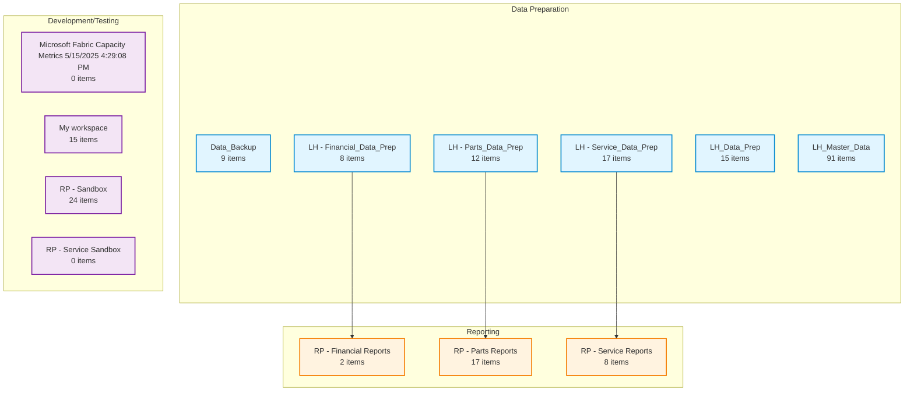
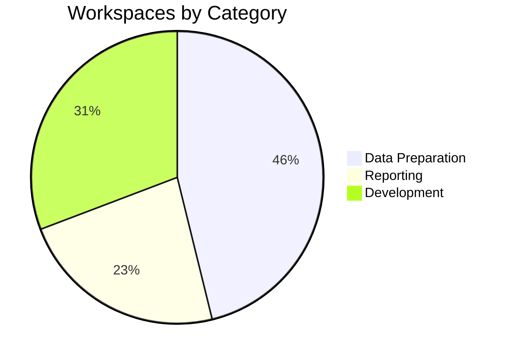
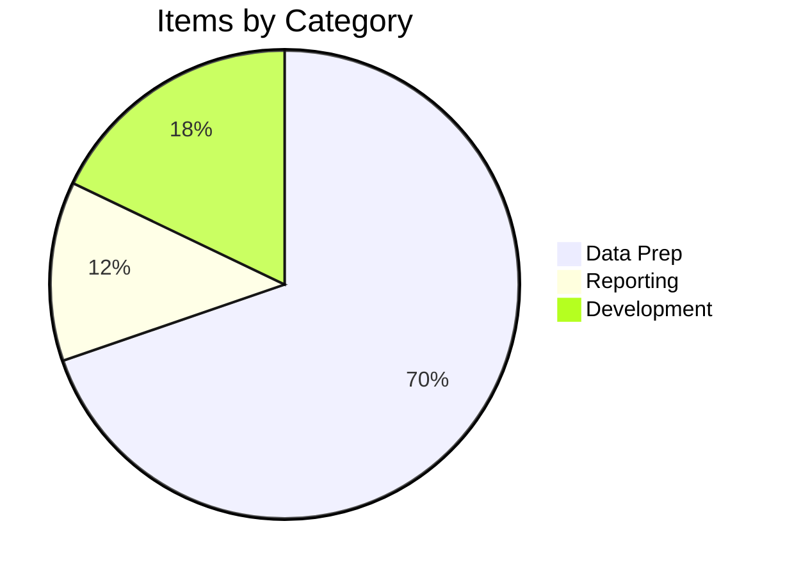

# Fabric Workspace Lineage Diagram

**Generated:** 2025-10-09 16:42:26

This diagram shows the relationships between your Fabric workspaces organized by category.

---

## Overview Diagram

---

## Workspace Distribution

---

## Items Distribution

---

## Legend

- **Blue boxes**: Data Preparation workspaces
- **Orange boxes**: Reporting workspaces
- **Purple boxes**: Development/Testing workspaces
- **Arrows (→)**: Data flow relationships

---

## Workspace Details

| Workspace | Category | Items | Type |
|-----------|----------|-------|------|
| Data_Backup | DataPrep | 9 | Workspace |
| LH - Financial_Data_Prep | DataPrep | 8 | Workspace |
| LH - Parts_Data_Prep | DataPrep | 12 | Workspace |
| LH - Service_Data_Prep | DataPrep | 17 | Workspace |
| LH_Data_Prep | DataPrep | 15 | Workspace |
| LH_Master_Data | DataPrep | 91 | Workspace |
| Microsoft Fabric Capacity Metrics 5/15/2025 4:29:08 PM | Development | 0 | Workspace |
| My workspace | Development | 15 | Personal |
| RP - Financial Reports | Reporting | 2 | Workspace |
| RP - Parts Reports | Reporting | 17 | Workspace |
| RP - Sandbox | Development | 24 | Workspace |
| RP - Service Reports | Reporting | 8 | Workspace |
| RP - Service Sandbox | Development | 0 | Workspace |

---

## Statistics

- **Total Workspaces:** 13
- **Total Items:** 218
- **Average Items per Workspace:** 16.8

### By Category

- **Data Preparation:** 6 workspaces, 152 items
- **Reporting:** 3 workspaces, 27 items
- **Development:** 4 workspaces, 39 items

---

**Note:** This lineage diagram shows organizational structure. Actual data flow may vary.
For detailed item-level relationships, see individual workspace documentation.

