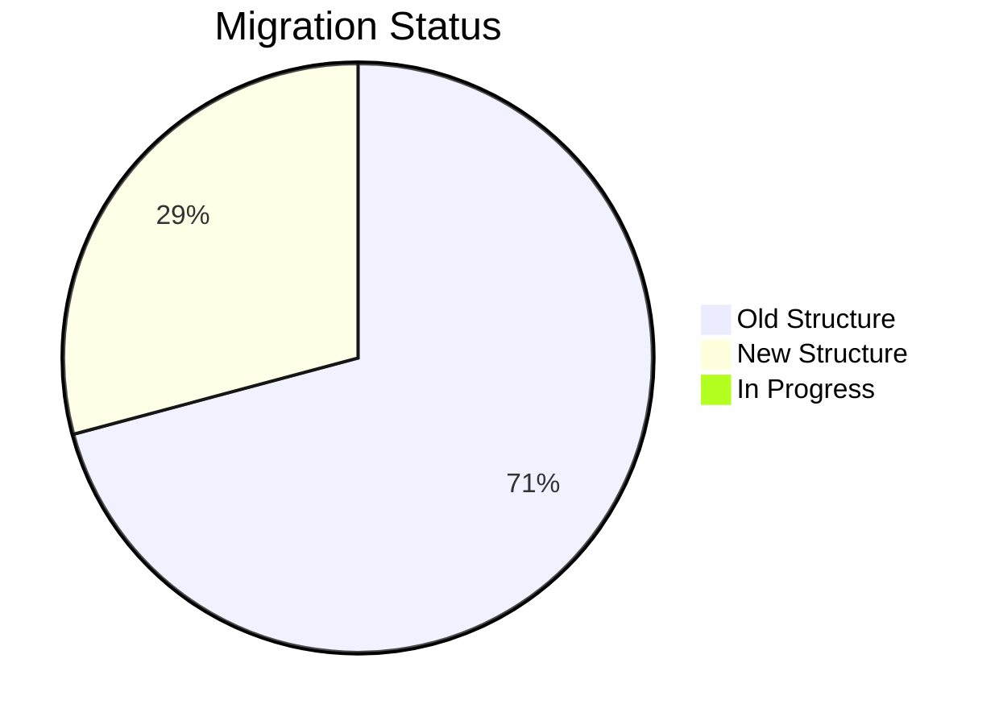

# Report Migration Tracking

**Generated:** 2025-10-21 09:12:36
**Total Reports:** 26

---

## Executive Summary

### Migration Status Overview

| Status | Count | Percentage |
|--------|-------|------------|
| N/A | 2 | 7.7% |
| New Structure | 7 | 26.9% |
| Old Structure | 17 | 65.4% |

### Data Location Summary

| Location | Count |
|----------|-------|
| Excel | 2 |
| LH - Financial_Data_Prep | 1 |
| LH - Parts_Data_Prep | 11 |
| LH - Service_Data_Prep | 5 |
| LH_Master_Data | 7 |

---

## Migration Progress

---

## Detailed Report Inventory

### RP - Financial Reports

**Report Count:** 1

#### 60+ Days Past Due

| Property | Value |
|----------|-------|
| **Workspace** | RP - Financial Reports |
| **Data Location** | LH - Financial_Data_Prep |
| **Dataflows Used** | DF_ArMaster_Financial |
| **Tables Used** | ArMaster, ArMaster_Customer, InSalOrd_InSalPar |
| **Update Schedule** | Not Set |
| **Last Updated** | 10/20/2025 |
| **Migration Status** | Old Structure |
| **Notes** | Needs Update? |

---

### RP - Parts Reports

**Report Count:** 9

#### Bin Location Report

| Property | Value |
|----------|-------|
| **Workspace** | RP - Parts Reports |
| **Data Location** | LH_Master_Data |
| **Dataflows Used** | df_JDIS_PART_INFORMATION_Raw |
| **Tables Used** | jdis_Part_Information |
| **Update Schedule** | Not Set |
| **Last Updated** | 10/20/2025 |
| **Migration Status** | New Structure |
| **Notes** | New Report, New data structure |

#### Combine Vault Transfers

| Property | Value |
|----------|-------|
| **Workspace** | RP - Parts Reports |
| **Data Location** | LH - Parts_Data_Prep |
| **Dataflows Used** | DF_JDIS_Parts_Information_Combine_Vault, DF_InTrans_Combine_Vault_12 |
| **Tables Used** | jdis_Parts_Info_Combine_Vault, InTrans_Combine_Vault_12 |
| **Update Schedule** | Not Set |
| **Last Updated** | 10/20/2025 |
| **Migration Status** | Old Structure |
| **Notes** | Replace with New Version? |

#### First Pass Fill

| Property | Value |
|----------|-------|
| **Workspace** | RP - Parts Reports |
| **Data Location** | LH - Parts_Data_Prep |
| **Dataflows Used** | DF_InHist_PmManage |
| **Tables Used** | InHist_PmManage_Pivot |
| **Update Schedule** | Not Set |
| **Last Updated** | 10/20/2025 |
| **Migration Status** | Old Structure |
| **Notes** | Replace with New Version? |

#### Negative On Hand-On Hand No Bin

| Property | Value |
|----------|-------|
| **Workspace** | RP - Parts Reports |
| **Data Location** | LH - Parts_Data_Prep |
| **Dataflows Used** | DF_Negative_On_Hand_Report |
| **Tables Used** | jdis_Part_Information_On_hand_No_Bin, jdis_Part_Information_Negative_On_Hand |
| **Update Schedule** | Not Set |
| **Last Updated** | 10/20/2025 |
| **Migration Status** | Old Structure |
| **Notes** | Needs Update? |

#### Parts Adjustments

| Property | Value |
|----------|-------|
| **Workspace** | RP - Parts Reports |
| **Data Location** | LH - Parts_Data_Prep |
| **Dataflows Used** | DF_Parts_Adjustments |
| **Tables Used** | InTrans - Parts Adjust, jdis - Parts Adjust, GlTrans - Parts Adjust |
| **Update Schedule** | Not Set |
| **Last Updated** | 10/20/2025 |
| **Migration Status** | Old Structure |
| **Notes** | Needs Update? |

#### Parts Sales with Low Margins

| Property | Value |
|----------|-------|
| **Workspace** | RP - Parts Reports |
| **Data Location** | LH - Parts_Data_Prep |
| **Dataflows Used** | DF_Part_Sales_With_Low_Margins, DF_InTrans_Combine_Vault_12 |
| **Tables Used** | InTrans_Low_Margin, Parts_Low_Margin_jdis_InMaster, InMaster_Combine_Vault, ArMaster_Customer_Low |
| **Update Schedule** | Not Set |
| **Last Updated** | 10/20/2025 |
| **Migration Status** | Old Structure |
| **Notes** | Needs Update? |

#### Parts with Open Orders

| Property | Value |
|----------|-------|
| **Workspace** | RP - Parts Reports |
| **Data Location** | LH - Parts_Data_Prep |
| **Dataflows Used** | DF_Parts_On_Work_Orders |
| **Tables Used** | Parts_Open_Tickets, Parts_Open_Tickets_Details |
| **Update Schedule** | Not Set |
| **Last Updated** | 10/20/2025 |
| **Migration Status** | Old Structure |
| **Notes** | Needs Update? |

#### Physical Inventory

| Property | Value |
|----------|-------|
| **Workspace** | RP - Parts Reports |
| **Data Location** | LH - Parts_Data_Prep |
| **Dataflows Used** | DF_jdis_Parts_Information_Physical_Inventory |
| **Tables Used** | jdis_Phy_Inv |
| **Update Schedule** | Not Set |
| **Last Updated** | 10/20/2025 |
| **Migration Status** | Old Structure |
| **Notes** | Needs Update? |

#### Unique Parts Customers

| Property | Value |
|----------|-------|
| **Workspace** | RP - Parts Reports |
| **Data Location** | LH - Parts_Data_Prep |
| **Dataflows Used** | DF_Unique_Parts_Customers |
| **Tables Used** | ArMaster_Customer_Unique, InTrans_Unique, Invoice |
| **Update Schedule** | Not Set |
| **Last Updated** | 10/20/2025 |
| **Migration Status** | Old Structure |
| **Notes** | Replace with New Version? |

---

### RP - Sandbox

**Report Count:** 12

#### Combine Vault Sales

| Property | Value |
|----------|-------|
| **Workspace** | RP - Sandbox |
| **Data Location** | LH_Master_Data |
| **Dataflows Used** | df_Dim_Branch12_Parts, df_Fact_Branch12_Transactions, df_Dim_Date |
| **Tables Used** | dim_Branch12_Parts, Fact_Branch12_Transactions, dim_DateTable |
| **Update Schedule** | Not Set |
| **Last Updated** | 10/20/2025 |
| **Migration Status** | New Structure |
| **Notes** | New Report, New data structure |

#### Customer Anatomy

| Property | Value |
|----------|-------|
| **Workspace** | RP - Sandbox |
| **Data Location** | LH - Parts_Data_Prep |
| **Dataflows Used** | DF_Customer_Anatomy, One Drive - Kurt |
| **Tables Used** | Base_Customer_Info, Service_Data, Parts_Data, Sales_Data_YTD, Sales_Data_PYTD, InTrans_Promo, Engaged Acres |
| **Update Schedule** | Not Set |
| **Last Updated** | 10/20/2025 |
| **Migration Status** | Old Structure |
| **Notes** | Needs Update? |

#### First Pass Fill V2

| Property | Value |
|----------|-------|
| **Workspace** | RP - Sandbox |
| **Data Location** | LH_Master_Data |
| **Dataflows Used** | df_Fact_First_Pass_Fill |
| **Tables Used** | Fact_FirstPassFill |
| **Update Schedule** | Not Set |
| **Last Updated** | 10/20/2025 |
| **Migration Status** | New Structure |
| **Notes** | Do we need to do anything else with this one? |

#### Inventory Analysis V3

| Property | Value |
|----------|-------|
| **Workspace** | RP - Sandbox |
| **Data Location** | LH_Master_Data |
| **Dataflows Used** | df_Fact_Inventory, df_Fact_Part_Transactions, df_Fact_Invoice_InventoryAnalysis |
| **Tables Used** | Fact_Inventory, Fact_Part_Transactions, Fact_Invoice_InventoryAnalysis |
| **Update Schedule** | Not Set |
| **Last Updated** | 10/20/2025 |
| **Migration Status** | New Structure |
| **Notes** | Waiting for aproval to move to production |

#### Key Customers

| Property | Value |
|----------|-------|
| **Workspace** | RP - Sandbox |
| **Data Location** | LH - Parts_Data_Prep |
| **Dataflows Used** | DF_Key_Customers, DF_Inspections, DF_Customer_Anatomy, One Drive - Kurt |
| **Tables Used** | Parts_Data_Key, Service_Data_Key, Sales_Data_Key, Parts_Promo, Job_Code_Times, Engaged Acres |
| **Update Schedule** | Not Set |
| **Last Updated** | 10/20/2025 |
| **Migration Status** | Old Structure |
| **Notes** | Needs Update? |

#### Parts Promo V2

| Property | Value |
|----------|-------|
| **Workspace** | RP - Sandbox |
| **Data Location** | LH - Parts_Data_Prep |
| **Dataflows Used** | DF_Customer_Anatomy |
| **Tables Used** | InTrans_All_Promo, Parts_Promo |
| **Update Schedule** | Not Set |
| **Last Updated** | 10/10/2025 |
| **Migration Status** | Old Structure |
| **Notes** | Needs Update? |

#### Price Matrix V2

| Property | Value |
|----------|-------|
| **Workspace** | RP - Sandbox |
| **Data Location** | LH_Master_Data |
| **Dataflows Used** | df_Fact_Inventory, df_Fact_Part_Transactions |
| **Tables Used** | Fact_Inventory, Fact_Part_Transactions |
| **Update Schedule** | Not Set |
| **Last Updated** | 10/20/2025 |
| **Migration Status** | New Structure |
| **Notes** | Do we need to do anything else with this one? |

#### Sparc Inventory Health

| Property | Value |
|----------|-------|
| **Workspace** | RP - Sandbox |
| **Data Location** | Excel |
| **Dataflows Used** | N/A |
| **Tables Used** | N/A |
| **Update Schedule** | Not Set |
| **Last Updated** | 10/20/2025 |
| **Migration Status** | N/A |
| **Notes** | Chart Build for SPARC |

#### Table and Column Names

| Property | Value |
|----------|-------|
| **Workspace** | RP - Sandbox |
| **Data Location** | Excel |
| **Dataflows Used** | Local C:\Power BI\Data\Data |
| **Tables Used** | Table Names-Columns |
| **Update Schedule** | Not Set |
| **Last Updated** | 10/20/2025 |
| **Migration Status** | N/A |
| **Notes** | Reference report |

#### Top 50 - Job Codes

| Property | Value |
|----------|-------|
| **Workspace** | RP - Sandbox |
| **Data Location** | LH_Master_Data |
| **Dataflows Used** | df_Fact_Top50_JobCodes |
| **Tables Used** | Fact_Top_JobCode_Anaysis |
| **Update Schedule** | Not Set |
| **Last Updated** | 10/20/2025 |
| **Migration Status** | New Structure |
| **Notes** | Need to Update, Move to Service? |

#### Unique Parts Customers V2

| Property | Value |
|----------|-------|
| **Workspace** | RP - Sandbox |
| **Data Location** | LH_Master_Data |
| **Dataflows Used** | df_Fact_InTrans_UniqueCustomers, df_Fact_Invoice_UniqueCustomers |
| **Tables Used** | Fact_InTrans_UniqueCustomers, Fact_Invoice_UniqueCustomers |
| **Update Schedule** | Not Set |
| **Last Updated** | 10/20/2025 |
| **Migration Status** | New Structure |
| **Notes** | Do we need to do anything else with this one? |

#### WIP

| Property | Value |
|----------|-------|
| **Workspace** | RP - Sandbox |
| **Data Location** | LH - Service_Data_Prep |
| **Dataflows Used** | DF_WIP_Report, DF_Technician_Data |
| **Tables Used** | RepairOrderDetail, Technician_Code_Names, TechnicianInvoiceDetail, TechnicianPunchedDetail |
| **Update Schedule** | Not Set |
| **Last Updated** | 10/20/2025 |
| **Migration Status** | Old Structure |
| **Notes** | Still sitting in Sandbox but there is another report call Open WorkOrders in Service Reports, does this need to move to Service Reports? Update Needed? |

---

### RP - Service Reports

**Report Count:** 4

#### Inspections

| Property | Value |
|----------|-------|
| **Workspace** | RP - Service Reports |
| **Data Location** | LH - Service_Data_Prep |
| **Dataflows Used** | DF_Inspections, DF_WIP_Report |
| **Tables Used** | Job_Code_Times, InTrans_Inspect, RepairOrderDetail, TechnicianPunchedDetail |
| **Update Schedule** | Not Set |
| **Last Updated** | 10/20/2025 |
| **Migration Status** | Old Structure |
| **Notes** | Needs Update? |

#### Labor Performance

| Property | Value |
|----------|-------|
| **Workspace** | RP - Service Reports |
| **Data Location** | LH - Service_Data_Prep |
| **Dataflows Used** | DF_Technician_Data |
| **Tables Used** | Technician_Code_Names, TechnicianAttendance, TechnicianEfficiency, TechnicianInvoice, TechnicianPunchedTime |
| **Update Schedule** | Not Set |
| **Last Updated** | 10/20/2025 |
| **Migration Status** | Old Structure |
| **Notes** | Needs Update? |

#### Open Work Orders

| Property | Value |
|----------|-------|
| **Workspace** | RP - Service Reports |
| **Data Location** | LH - Service_Data_Prep |
| **Dataflows Used** | DF_WIP_Report, DF_Technician_Data |
| **Tables Used** | RepairOrderDetail, Technician_Code_Names, TechnicianInvoiceDetail, TechnicianPunchedDetail, WkRoFile, AgingReport, ArMaster_Customer |
| **Update Schedule** | Not Set |
| **Last Updated** | 10/20/2025 |
| **Migration Status** | Old Structure |
| **Notes** | Needs Update? |

#### Planter Inspection Part Sales

| Property | Value |
|----------|-------|
| **Workspace** | RP - Service Reports |
| **Data Location** | LH - Service_Data_Prep |
| **Dataflows Used** | DF_Planter_Parts, DF_Inspections |
| **Tables Used** | Planter_Parts, Planter_Part_List, Planter_With_Inpection_Parts, Planter_Inspection_Parts |
| **Update Schedule** | Not Set |
| **Last Updated** | 10/20/2025 |
| **Migration Status** | Old Structure |
| **Notes** | Needs migration |

---

## Reports Needing Migration

The following 17 reports still use the old data structure:

- **60+ Days Past Due** (RP - Financial Reports) - Currently uses: LH - Financial_Data_Prep
- **Combine Vault Transfers** (RP - Parts Reports) - Currently uses: LH - Parts_Data_Prep
- **First Pass Fill** (RP - Parts Reports) - Currently uses: LH - Parts_Data_Prep
- **Negative On Hand-On Hand No Bin** (RP - Parts Reports) - Currently uses: LH - Parts_Data_Prep
- **Parts Adjustments** (RP - Parts Reports) - Currently uses: LH - Parts_Data_Prep
- **Parts Sales with Low Margins** (RP - Parts Reports) - Currently uses: LH - Parts_Data_Prep
- **Parts with Open Orders** (RP - Parts Reports) - Currently uses: LH - Parts_Data_Prep
- **Physical Inventory** (RP - Parts Reports) - Currently uses: LH - Parts_Data_Prep
- **Unique Parts Customers** (RP - Parts Reports) - Currently uses: LH - Parts_Data_Prep
- **Customer Anatomy** (RP - Sandbox) - Currently uses: LH - Parts_Data_Prep
- **Key Customers** (RP - Sandbox) - Currently uses: LH - Parts_Data_Prep
- **Parts Promo V2** (RP - Sandbox) - Currently uses: LH - Parts_Data_Prep
- **WIP** (RP - Sandbox) - Currently uses: LH - Service_Data_Prep
- **Inspections** (RP - Service Reports) - Currently uses: LH - Service_Data_Prep
- **Labor Performance** (RP - Service Reports) - Currently uses: LH - Service_Data_Prep
- **Open Work Orders** (RP - Service Reports) - Currently uses: LH - Service_Data_Prep
- **Planter Inspection Part Sales** (RP - Service Reports) - Currently uses: LH - Service_Data_Prep

---

## How to Use This Tracker

### Updating the CSV
1. Open `Report-Migration-Tracker.csv` in Excel
2. For each report, fill in:
   - **DataflowsUsed**: Comma-separated list of dataflow names
   - **TablesUsed**: Comma-separated list of table names
   - **UpdateSchedule**: When the report refreshes
   - **LastUpdated**: Last refresh date
   - **MigrationStatus**: Current status
3. Save the CSV
4. Run `Generate-MigrationReport.ps1` to update this document

### Migration Status Values
- **Old Structure**: Uses LH - *_Data_Prep workspaces
- **New Structure**: Uses LH_Master_Data (new data model)
- **In Progress**: Currently being rebuilt/migrated
- **Migrated**: Successfully moved to new structure

### Finding Dataflows and Tables
For each report:
1. Open report in Power BI Desktop
2. **Transform Data** > **Data Source Settings**
3. Note the lakehouse and tables
4. Check lakehouse for dataflow names
5. Update CSV with this information

---

**Last Generated:** 2025-10-21 09:12:36

