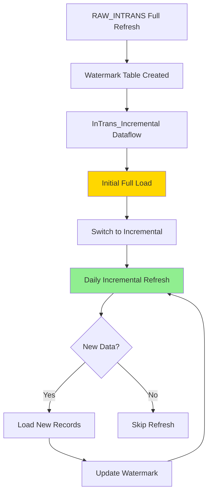

# Migration Guide: InTrans Full Refresh → Incremental Refresh

## Overview

This guide documents the migration from `RAW_INTRANS` (full refresh) to `InTrans_Incremental` (incremental refresh), which reduced refresh times from **16-18 minutes to 2-3 minutes** (85% improvement) while maintaining data integrity.

**Date of Migration:** [Your migration date]  
**Completion Status:** ✅ Successfully implemented and validated

## The Problem

### Original State: RAW_INTRANS

**Source:** ODBC connection to ERP parts transaction table  
**Refresh Strategy:** Full refresh every run  
**Data Volume:** 6 years of historical data (~300,000-500,000 rows)

**Performance Issues:**
```
Refresh Duration: 16-18 minutes
CU Consumption: ~8-10 CU per refresh
Impact: Single biggest bottleneck in pipeline
System Impact: Caused F4 capacity throttling
```

**Why Full Refresh Was Problematic:**
1. Historical data (6 years) refreshed unnecessarily every time
2. Data is mostly append-only (parts transactions don't change)
3. Only need to load new transactions from last refresh
4. Excessive CU consumption for no benefit

## The Solution

### New State: InTrans_Incremental

**Implementation:** Watermark table approach  
**Refresh Strategy:** Incremental based on `TransDatetime`  
**Data Volume:** Only new/changed records since last refresh

**Performance Improvement:**
```
Refresh Duration: 2-3 minutes
CU Consumption: ~1-2 CU per refresh
Improvement: 85% faster, 80% less CU
Impact: Removed system throttling
```

## Migration Architecture

### High-Level Flow



## Implementation Steps

### Step 1: Create Watermark Table

**Purpose:** Track the last refresh timestamp to determine which records to load

**Table Structure:**
```sql
CREATE TABLE Watermark_InTrans (
    TableName VARCHAR(50) PRIMARY KEY,
    LastMaxValue DATETIME,
    LastRefreshDate DATETIME
)

-- Initialize
INSERT INTO Watermark_InTrans 
VALUES ('InTrans', '2019-01-01 00:00:00', GETDATE())
```

**Location:** Lakehouse (same workspace)  
**Access:** Dataflow reads and updates this table

### Step 2: Create InTrans_Incremental Dataflow

**Dataflow Name:** `DF_InTrans_Incremental`

**Query Logic:**
```powerquery
let
    // Get last watermark value
    WatermarkTable = Lakehouse.InTrans_Watermark,
    LastMaxValue = WatermarkTable{[TableName="InTrans"]}[LastMaxValue],
    
    // Query source with incremental filter
    Source = Odbc.DataSource(
        "DSN=YourDSN", 
        [
            Query = "
                SELECT 
                    WorkOrder,
                    BranchID,
                    TransDatetime,
                    PartNumber,
                    Quantity,
                    UnitCost,
                    ExtendedCost,
                    TransType,
                    ModifiedDate,
                    -- Convert WorkOrder to text for joins
                    CAST(WorkOrder AS VARCHAR(50)) AS WorkOrder_Text
                FROM InTransTable
                WHERE TransDatetime > '" & DateTime.ToText(LastMaxValue, "yyyy-MM-dd HH:mm:ss") & "'
                ORDER BY TransDatetime
            "
        ]
    ),
    
    // Data transformations
    TypedColumns = Table.TransformColumnTypes(Source, {
        {"WorkOrder", Int64.Type},
        {"BranchID", type text},
        {"TransDatetime", type datetime},
        {"Quantity", type number},
        {"UnitCost", type number},
        {"ExtendedCost", type number}
    }),
    
    // Get new max value for watermark update
    NewMaxValue = List.Max(TypedColumns[TransDatetime])
in
    TypedColumns
```

**Critical Configuration:**
- ✅ Query must fold to source (push filter to SQL)
- ✅ ORDER BY TransDatetime for predictable results
- ✅ Include WorkOrder_Text for downstream joins

### Step 3: Create Watermark Update Dataflow

**Dataflow Name:** `DF_Update_Watermark_InTrans`

**Purpose:** Update watermark after successful InTrans load

**Query Logic:**
```powerquery
let
    // Get latest TransDatetime from InTrans_Incremental
    InTransTable = Lakehouse.InTrans_Incremental,
    NewMaxValue = List.Max(InTransTable[TransDatetime]),
    
    // Update watermark table
    WatermarkTable = Lakehouse.Watermark_InTrans,
    UpdatedTable = Table.ReplaceRows(
        WatermarkTable,
        Table.SelectRows(WatermarkTable, each [TableName] = "InTrans"),
        {[
            TableName = "InTrans",
            LastMaxValue = NewMaxValue,
            LastRefreshDate = DateTime.LocalNow()
        ]}
    )
in
    UpdatedTable
```

### Step 4: Update Pipeline Configuration

**Phase 2 Pipeline:** `Pipeline_InTrans_Incremental`

**Activities:**

```json
{
  "activities": [
    {
      "name": "Refresh_InTrans_Incremental",
      "type": "DataflowRefresh",
      "properties": {
        "dataflow": "DF_InTrans_Incremental",
        "waitOnCompletion": true
      }
    },
    {
      "name": "Update_Watermark",
      "type": "DataflowRefresh",
      "dependsOn": [
        {
          "activity": "Refresh_InTrans_Incremental",
          "dependencyConditions": ["Succeeded"]
        }
      ],
      "properties": {
        "dataflow": "DF_Update_Watermark_InTrans",
        "waitOnCompletion": true
      }
    }
  ]
}
```

**Key Points:**
- Watermark update ONLY runs if InTrans refresh succeeds
- If InTrans fails, watermark stays unchanged (prevents data loss)
- Sequential execution ensures data consistency

### Step 5: Initial Full Load

**Process:**

1. **Set watermark to historical start date:**
```sql
UPDATE Watermark_InTrans 
SET LastMaxValue = '2019-01-01 00:00:00'
WHERE TableName = 'InTrans'
```

2. **Run InTrans_Incremental dataflow:**
```
Duration: 20-25 minutes (full historical load)
Expected: Loads all records from 2019-01-01 to present
```

3. **Verify row count:**
```dax
InTrans_Incremental Row Count = COUNTROWS(InTrans_Incremental)
// Should match original RAW_INTRANS count
```

4. **Validate data integrity:**
```sql
-- Compare totals
SELECT 
    COUNT(*) AS RowCount,
    SUM(ExtendedCost) AS TotalCost,
    MAX(TransDatetime) AS LatestTrans
FROM InTrans_Incremental

-- Should match:
SELECT 
    COUNT(*) AS RowCount,
    SUM(ExtendedCost) AS TotalCost,
    MAX(TransDatetime) AS LatestTrans
FROM RAW_INTRANS
```

5. **Verify watermark updated:**
```sql
SELECT * FROM Watermark_InTrans WHERE TableName = 'InTrans'
-- LastMaxValue should be latest TransDatetime
```

### Step 6: Transition to Incremental

**Once initial load validated:**

1. **Run daily incremental refresh:**
```
Expected duration: 2-3 minutes
Expected rows: Only new transactions (50-500 per day)
```

2. **Monitor for 1 week:**
   - Check refresh completes successfully
   - Verify watermark advances daily
   - Validate no missing data
   - Confirm row counts increase appropriately

3. **Parallel run with RAW_INTRANS:**
   - Keep old table refreshing for 1-2 weeks
   - Compare data between both tables daily
   - Validate aggregates match
   - Ensure no discrepancies

### Step 7: Cutover

**After successful validation:**

1. **Update downstream references:**
   - Fact_PartsTransactions → Use `InTrans_Incremental`
   - Any other queries → Point to new table
   - Update Power BI semantic model connections

2. **Deprecate RAW_INTRANS:**
   - Remove from Phase 1 refresh pipeline
   - Keep table for 30 days as backup
   - Archive old pipeline configuration
   - Update documentation

3. **Final validation:**
   - Refresh all downstream tables
   - Validate Power BI reports show correct data
   - Check all measures calculate properly
   - User acceptance testing

## Data Type Considerations

### Critical Fix: WorkOrder Text Conversion

**The Issue:**
```
RAW_INTRANS: WorkOrder = Integer
Fact_LaborJobSummary: WorkOrder = Text
Result: 0% join success ❌
```

**The Solution:**
```powerquery
// In InTrans_Incremental dataflow
CAST(WorkOrder AS VARCHAR(50)) AS WorkOrder_Text
```

**Why This Matters:**
- Joins failed because integer ≠ text comparison
- After adding text column, joins worked: 100% success ✅
- Critical lesson: Data types MUST match for relationships

## Troubleshooting the Migration

### Issue 1: First Refresh Always Fails

**Symptom:**
```
Error: "Query does not fold"
First run: Fails
Second run: Succeeds
```

**Cause:**
- Incremental refresh setup validation is strict
- First run tests query folding
- May fail even when query actually folds

**Solution:**
```
1. Verify query folds: Right-click step → "View Native Query"
2. If query shows SQL, folding is working
3. Run refresh again - should succeed
4. This is expected behavior, not a real issue
```

### Issue 2: Watermark Not Updating

**Symptom:**
```
InTrans_Incremental refreshes but loads same data every time
Watermark table shows old date
```

**Diagnosis:**
```sql
SELECT * FROM Watermark_InTrans
-- Check LastRefreshDate - is it updating?
```

**Solutions:**
1. Verify watermark update activity runs and succeeds
2. Check watermark dataflow has correct update logic
3. Ensure pipeline activities are in correct sequence
4. Validate permissions on watermark table

### Issue 3: Missing Recent Transactions

**Symptom:**
```
Report shows data through yesterday but not today
Transactions from last few hours missing
```

**Cause:**
- Watermark may be slightly ahead due to timing
- Source system transaction timestamps vs. refresh timing

**Solution:**
```powerquery
// Add buffer to watermark query
WHERE TransDatetime >= DATEADD(HOUR, -2, LastMaxValue)

// Overlaps last 2 hours to catch stragglers
// Lakehouse handles duplicates naturally
```

### Issue 4: Performance Regression

**Symptom:**
```
Incremental refresh taking 10-15 minutes
Not seeing expected 2-3 minute refresh
```

**Diagnosis:**
```sql
-- Check how many rows being loaded
SELECT COUNT(*) 
FROM InTransTable
WHERE TransDatetime > [Last Watermark]

-- Should be: 50-500 rows per day
-- If thousands+, something wrong
```

**Solutions:**
1. Verify watermark is advancing (not stuck at old date)
2. Check source system for data quality issues (duplicate timestamps)
3. Ensure query folding is working (not pulling all data)
4. Review network/connection performance

## Validation Queries

### Daily Validation (Automated)

**Check 1: Refresh Success**
```dax
Last Refresh Success = 
VAR LastRefresh = MAX(Watermark_InTrans[LastRefreshDate])
VAR HoursSinceRefresh = DATEDIFF(LastRefresh, NOW(), HOUR)
RETURN
IF(
    HoursSinceRefresh <= 24,
    "✓ Success",
    "⚠ Warning: " & HoursSinceRefresh & " hours since last refresh"
)
```

**Check 2: Watermark Advancing**
```sql
SELECT 
    LastMaxValue,
    LastRefreshDate,
    DATEDIFF(HOUR, LastMaxValue, GETDATE()) AS HoursBehind
FROM Watermark_InTrans
WHERE TableName = 'InTrans'
-- HoursBehind should be < 24 for daily refreshes
```

**Check 3: Row Count Growing**
```dax
InTrans Daily Growth = 
VAR TodayCount = CALCULATE(COUNTROWS(InTrans_Incremental), InTrans_Incremental[TransDatetime] = TODAY())
VAR YesterdayCount = CALCULATE(COUNTROWS(InTrans_Incremental), InTrans_Incremental[TransDatetime] = TODAY() - 1)
RETURN
IF(
    TodayCount > 0,
    "✓ " & TodayCount & " new records today",
    IF(
        YesterdayCount > 0,
        "⚠ No records today (yesterday had " & YesterdayCount & ")",
        "⚠ No recent records"
    )
)
```

### Weekly Validation (Manual)

**Comprehensive Data Integrity Check:**

```sql
-- Compare InTrans_Incremental vs. source system
-- Run in both systems, compare results

SELECT 
    COUNT(*) AS TotalRecords,
    COUNT(DISTINCT WorkOrder) AS UniqueWorkOrders,
    MIN(TransDatetime) AS EarliestTrans,
    MAX(TransDatetime) AS LatestTrans,
    SUM(ExtendedCost) AS TotalCost,
    AVG(ExtendedCost) AS AvgTransactionValue
FROM InTrans_Incremental
WHERE TransDatetime >= DATEADD(DAY, -7, GETDATE())

-- Results should match source system exactly
```

## Performance Metrics

### Before vs. After

**Full Refresh (RAW_INTRANS):**
```
Daily Refresh:
- Duration: 16-18 minutes
- CU Usage: 8-10 CU
- Data Loaded: 300K-500K rows (entire history)
- Query Pattern: SELECT * FROM InTransTable

Monthly Impact:
- Duration: 400-450 minutes (6.6-7.5 hours)
- CU Usage: 200-250 CU
- Throttling: Frequent on F4 capacity
```

**Incremental Refresh (InTrans_Incremental):**
```
Daily Refresh:
- Duration: 2-3 minutes
- CU Usage: 1-2 CU
- Data Loaded: 50-500 rows (new transactions only)
- Query Pattern: WHERE TransDatetime > [LastMaxValue]

Monthly Impact:
- Duration: 50-75 minutes (0.8-1.2 hours)
- CU Usage: 25-50 CU
- Throttling: Eliminated
```

**Improvement:**
- ⚡ **85% faster** per refresh
- 💰 **80% less CU** per refresh
- 🎯 **Monthly savings:** 5.8 hours + 175 CU

## Lessons Learned

### 1. Watermark Table Approach is Reliable

**What Worked:**
- Simple table structure (3 columns)
- Easy to troubleshoot (just SELECT from table)
- Manual override possible if needed (UPDATE watermark)
- No complex state management

**Better Than:**
- Power BI incremental refresh (not available in Fabric Dataflow Gen2)
- Custom M code for state management
- File-based watermarks

### 2. Query Folding is Critical

**Verification Method:**
```powerquery
// Right-click any step in Power Query
// Select "View Native Query"
// If you see SQL, folding is working ✅
```

**If Not Folding:**
- Incremental refresh loads ALL data (defeats purpose)
- Performance would be WORSE than full refresh
- CU consumption would spike dramatically

### 3. Data Type Mismatches Break Everything

**Key Insight:**
```
Even if table exists, relationships exist, data exists...
If data types don't match: Joins = 0 results

Integer ≠ Text
Integer ≠ Decimal
Datetime ≠ Date
```

**Always Validate:**
- Source data type
- Destination data type
- Join column data types in both tables

### 4. Buffer Zone Prevents Edge Cases

**Problem:**
```
Transaction at 11:59:59 PM
Refresh runs at 12:00:00 AM
Watermark = 11:59:00 PM
Transaction missed ❌
```

**Solution:**
```powerquery
// Add 2-hour buffer
WHERE TransDatetime >= DATEADD(HOUR, -2, LastMaxValue)

// Small overlap, duplicates handled naturally
// Ensures no gaps in data
```

### 5. Parallel Run Period is Invaluable

**Strategy:**
```
Week 1-2: Run both RAW_INTRANS and InTrans_Incremental
Week 2-3: Monitor for discrepancies
Week 3-4: Validate with users
Week 4+: Cutover with confidence
```

**Benefits:**
- Catch issues before users affected
- Easy rollback if problems found
- Build confidence in new system
- Smooth transition, no downtime

## Migration Checklist

**Pre-Migration:**
- [ ] Create watermark table structure
- [ ] Initialize watermark with historical start date
- [ ] Create InTrans_Incremental dataflow
- [ ] Verify query folding works
- [ ] Test with small date range first

**Migration:**
- [ ] Run initial full load
- [ ] Validate row counts match RAW_INTRANS
- [ ] Verify data integrity (totals, min/max dates)
- [ ] Confirm watermark updates after refresh
- [ ] Test incremental refresh (advance watermark, run again)

**Validation:**
- [ ] Run parallel for 2 weeks
- [ ] Compare data daily between old and new
- [ ] Monitor refresh duration and CU usage
- [ ] Test all downstream dependencies
- [ ] User acceptance testing

**Cutover:**
- [ ] Update Fact_PartsTransactions to use InTrans_Incremental
- [ ] Update semantic model connections
- [ ] Remove RAW_INTRANS from Phase 1 pipeline
- [ ] Update documentation
- [ ] Archive old configuration

**Post-Migration:**
- [ ] Monitor daily for 1 month
- [ ] Track success rate and performance
- [ ] Optimize further if needed
- [ ] Document lessons learned

## Future Enhancements

**Potential Improvements:**

1. **Multiple Watermark Columns**
   - Track both TransDatetime AND ModifiedDate
   - Catch rare historical updates
   - More comprehensive change detection

2. **Partition by Year/Quarter**
   - Further optimize query performance
   - Easier historical data archival
   - Supports 10+ years of history efficiently

3. **Automated Reconciliation**
   - Daily comparison with source system
   - Alert if row counts diverge
   - Auto-correct if minor discrepancies

4. **Smart Full Refresh**
   - Monthly full refresh to catch any updates
   - Verify incremental didn't miss anything
   - Scheduled during low-usage window

---

**Related Documentation:**
- [Phase 2: InTrans Incremental](./phase-2-intrans-incremental.md)
- [Architecture Overview](./architecture-overview.md)
- [Troubleshooting Guide](./troubleshooting-guide.md)