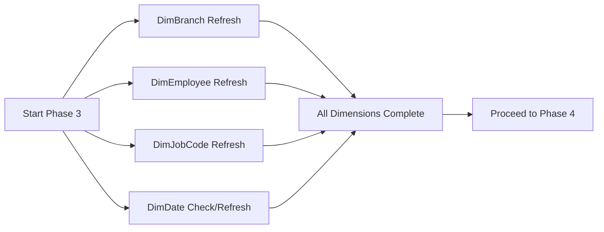

# Phase 3: Dimension Tables Refresh

## Overview

Phase 3 refreshes all dimension tables that support the Inspections Report. These tables provide the context and attributes for analyzing fact data. This phase typically completes in 2-3 minutes.

**Pipeline Name:** `Pipeline_Dimensions_Inspections` (if separate) or part of `Pipeline_Facts_Inspections`

## Dimension Tables

### Core Dimensions

#### 1. DimBranch
**Purpose:** Branch/location hierarchy and attributes
- **Source:** `RAW_BRANCH` via Dataflow
- **Key Column:** `BranchID`
- **Attributes:**
  - Branch name and code
  - Location type (Main, Sub, Service)
  - Geographic information
  - Active status

**Refresh Strategy:** Full refresh
- Small table (~50-100 rows)
- Changes infrequently
- Full refresh completes in seconds

#### 2. DimEmployee
**Purpose:** Technician and employee information
- **Source:** `RAW_EMPLOYEE` via Dataflow
- **Key Column:** `EmployeeID`
- **Attributes:**
  - Employee name
  - Job title/role
  - Department
  - Active status
  - Hire/termination dates

**Refresh Strategy:** Full refresh
- Moderate size (~500-1000 rows)
- Updates happen periodically (new hires, status changes)
- Full refresh completes quickly

#### 3. DimJobCode
**Purpose:** Inspection job code definitions and categories
- **Source:** `RAW_JOBCODE` via Dataflow
- **Key Column:** `JobCode`
- **Attributes:**
  - Job code and description
  - Equipment type (Tractor, Combine, etc.)
  - Service level (Basic, Standard, Premium, Ultimate)
  - Inspection category flags
  - Labor rate

**Refresh Strategy:** Full refresh
- Small table (~150-200 rows covering 111 inspection codes)
- Very stable - changes only when new inspection types added
- Critical for inspection logic - must be accurate

**Business Logic:**
```sql
-- Inspection code patterns
'AI%' = Air Seeder inspections
'CI%' = Combine inspections  
'DI%' = Disc inspections
'TI%' = Tractor inspections
'SI%' = Sprayer inspections
'PI%' = Planter inspections
'WI%' = Windrower inspections

-- Service levels by last digit
'%1' = Basic (1 hour)
'%2' = Standard (2 hours)
'%3' = Premium (3 hours)  
'%4' = Ultimate (4 hours)
```

#### 4. DimDate
**Purpose:** Date dimension for time-based analysis
- **Source:** Generated table (Dataflow or DAX)
- **Key Column:** `Date`
- **Attributes:**
  - Date hierarchy (Year, Quarter, Month, Week, Day)
  - Fiscal periods
  - Business day flags
  - Season indicators

**Refresh Strategy:** 
- Generated dynamically covering date range: `2019-01-01` to `CurrentDate + 1 year`
- Refresh only when date range needs expansion
- Typically refreshed monthly or quarterly

### Dimension Refresh Patterns



## Refresh Configuration

### Parallel Execution
All dimension refreshes can run in **parallel** since they have no dependencies on each other:

```json
{
  "activities": [
    {
      "name": "Refresh_DimBranch",
      "type": "DataflowRefresh",
      "waitOnCompletion": true
    },
    {
      "name": "Refresh_DimEmployee", 
      "type": "DataflowRefresh",
      "waitOnCompletion": true
    },
    {
      "name": "Refresh_DimJobCode",
      "type": "DataflowRefresh", 
      "waitOnCompletion": true
    },
    {
      "name": "Refresh_DimDate",
      "type": "DataflowRefresh",
      "waitOnCompletion": true
    }
  ],
  "concurrency": 4
}
```

### Performance Considerations

**Expected Duration:**
- DimBranch: 15-30 seconds
- DimEmployee: 30-60 seconds
- DimJobCode: 15-30 seconds
- DimDate: 15-30 seconds (if refresh needed)
- **Total (parallel):** ~60-90 seconds

**CU Consumption:**
- Very low - dimensions are small
- Approximately 0.1-0.2 CU total
- No incremental refresh needed due to small size

### Error Handling

```json
{
  "errorHandling": {
    "retry": {
      "count": 2,
      "intervalInSeconds": 30
    },
    "continueOnError": false
  }
}
```

**Rationale:** 
- Dimensions are critical for fact table joins
- If dimension refresh fails, fact refresh should not proceed
- Better to fail early than load facts without dimension context

## Data Quality Checks

### Post-Refresh Validation

After dimension refresh, validate:

1. **Row Counts:** Ensure tables populated
```dax
DimBranch Row Count = COUNTROWS(DimBranch)
DimEmployee Row Count = COUNTROWS(DimEmployee)
DimJobCode Row Count = COUNTROWS(DimJobCode)
```

2. **Key Uniqueness:** Verify no duplicates
```sql
-- Check for duplicate keys
SELECT BranchID, COUNT(*) 
FROM DimBranch 
GROUP BY BranchID 
HAVING COUNT(*) > 1
```

3. **Required Values:** Validate critical codes exist
```sql
-- Verify all inspection codes present
SELECT COUNT(DISTINCT JobCode) 
FROM DimJobCode 
WHERE JobCode LIKE '%I%'
-- Should return 111
```

### Dimension Change Detection

**Type 0 (No History):** 
- DimJobCode - values never change once defined

**Type 1 (Overwrite):**
- DimBranch - location changes overwrite
- DimEmployee - status updates overwrite

**Type 2 (History Tracking):**
- Not currently implemented
- Could add for employee role changes if needed

## Integration with Facts

### Dimension Usage in Fact Tables

**Fact_LaborJobSummary** joins:
- DimEmployee (EmployeeID)
- DimBranch (BranchID)  
- DimJobCode (JobCode)
- DimDate (JobDate)

**Fact_PartsTransactions** joins:
- DimBranch (BranchID)
- DimDate (TransDate)

**Fact_WorkOrderParts** joins:
- DimBranch (BranchID)
- DimJobCode (JobCode)
- DimDate (WorkOrderDate)

### Relationship Configuration

All relationships are:
- **One-to-Many:** Dimension (One) to Fact (Many)
- **Single Cross Filter:** From Dimension to Fact
- **Active Relationships Only**

## Scheduling

### Refresh Frequency

**Development:**
- On-demand via manual pipeline trigger
- After Phase 1 (Raw) completes
- Before Phase 4 (Facts) begins

**Production:**
- Daily at 6:00 AM (after raw data load)
- As part of master orchestrator
- Conditional refresh only if raw data changed

### Dependencies

**Upstream:**
- ✅ Phase 1 Raw tables must complete successfully
- ✅ Dataflows must have latest source data

**Downstream:**
- ⏸️ Phase 4 Fact tables wait for dimension completion
- ⏸️ Semantic model refresh waits for all dimensions

## Troubleshooting

### Common Issues

#### Issue: Dimension table empty after refresh
**Symptom:** Row count = 0  
**Cause:** Dataflow source query failing or returning no data  
**Solution:**
1. Check source table exists and has data
2. Verify dataflow query syntax
3. Test dataflow in isolation
4. Review activity logs for errors

#### Issue: Duplicate keys in dimension
**Symptom:** Relationship errors in semantic model  
**Cause:** Source data has duplicates  
**Solution:**
1. Add DISTINCT to dataflow query
2. Identify root cause in source system
3. Implement deduplication logic based on business rules

#### Issue: Missing job codes
**Symptom:** Fact records don't join to DimJobCode  
**Cause:** New job codes added to source not in dimension  
**Solution:**
1. Refresh DimJobCode from current source
2. Verify source table includes all active codes
3. Check for case-sensitivity issues in job code values

### Monitoring Queries

**Check Dimension Freshness:**
```sql
SELECT 
    'DimBranch' AS TableName,
    MAX(LastModified) AS LastRefresh,
    COUNT(*) AS RowCount
FROM DimBranch
UNION ALL
SELECT 
    'DimEmployee',
    MAX(LastModified),
    COUNT(*)
FROM DimEmployee
```

**Validate Relationships:**
```dax
Fact Records Without Branch = 
CALCULATE(
    COUNTROWS(Fact_LaborJobSummary),
    ISBLANK(RELATED(DimBranch[BranchName]))
)
```

## Best Practices

1. **Always refresh dimensions before facts** - ensures referential integrity
2. **Use parallel execution** - dimensions are independent
3. **Validate post-refresh** - check row counts and key uniqueness
4. **Keep dimensions small** - full refresh is acceptable when tables are compact
5. **Document business rules** - especially for DimJobCode inspection logic
6. **Monitor for orphaned records** - facts without matching dimension keys

## Next Steps

After Phase 3 completes:
- → Proceed to [Phase 4: Facts & Semantic Models](./phase-4-facts-semantic-models.md)
- Review [Troubleshooting Guide](./troubleshooting-guide.md) if issues arise
- See [Architecture Overview](./architecture-overview.md) for full context

---

**Related Documentation:**
- [Phase 1: Raw Data](./phase-1-raw-data.md)
- [Phase 2: InTrans Incremental](./phase-2-intrans-incremental.md)
- [Phase 4: Facts & Semantic Models](./phase-4-facts-semantic-models.md)