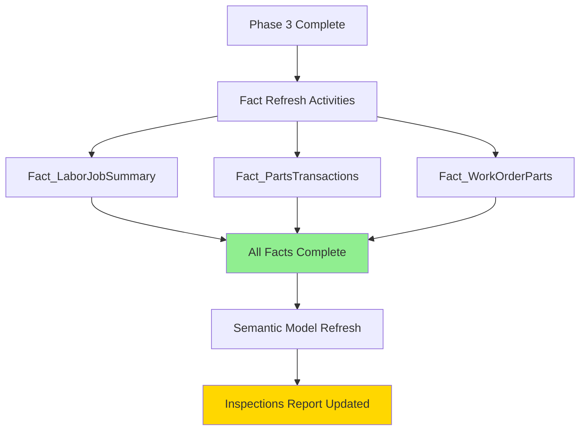

# Phase 4: Fact Tables & Semantic Models Refresh

## Overview

Phase 4 is the final and most critical phase, refreshing the three fact tables and updating the Power BI semantic model. This phase typically completes in **13-15 minutes** with parallel execution.

**Pipeline Name:** `Pipeline_Facts_Inspections`

## Architecture



## Fact Tables

### 1. Fact_LaborJobSummary

**Purpose:** Core inspection labor tracking  
**Source:** `RAW_LABOR` via Dataflow  
**Granularity:** One row per work order line item

**Key Measures:**
- Labor hours (actual vs. goal)
- Labor costs
- Technician assignments
- Inspection completion status

**Dimensions:**
- DimEmployee (Technician)
- DimBranch (Service location)
- DimJobCode (Inspection type)
- DimDate (Service date)

**Refresh Strategy:**
- **Type:** Full refresh (currently)
- **Duration:** ~5-7 minutes
- **Rationale:** Historical records can be updated (status changes, billing adjustments)

**Sample Query Logic:**
```sql
SELECT 
    l.WorkOrder,
    l.WorkOrderLineNumber,
    l.BranchID,
    l.EmployeeID,
    l.JobCode,
    l.JobDate,
    l.LaborHours,
    l.LaborCost,
    l.Status,
    -- Join to get branch sub-location details
    b.MainBranchID,
    b.IsSubLocation,
    -- Calculate goal hours from job code
    jc.StandardHours AS GoalHours
FROM RAW_LABOR l
LEFT JOIN DimBranch b ON l.BranchID = b.BranchID
LEFT JOIN DimJobCode jc ON l.JobCode = jc.JobCode
WHERE l.JobDate >= DATEADD(YEAR, -6, GETDATE())
```

### 2. Fact_PartsTransactions

**Purpose:** Parts usage and costs for inspections  
**Source:** `InTrans_Incremental` via Dataflow  
**Granularity:** One row per parts transaction

**Key Measures:**
- Parts costs (actual vs. goal)
- Part quantities
- Transaction types

**Dimensions:**
- DimBranch (Transaction location)
- DimDate (Transaction date)

**Refresh Strategy:**
- **Type:** Incremental via source table
- **Duration:** ~2-3 minutes (benefits from InTrans incremental)
- **Advantage:** Leverages Phase 2's watermark strategy

**Incremental Benefit:**
```
Before InTrans Incremental: 16-18 minutes
After InTrans Incremental:  2-3 minutes
Improvement: 85% faster ⚡
```

**Sample Query Logic:**
```sql
SELECT 
    i.WorkOrder,
    i.BranchID,
    i.TransDatetime AS TransDate,
    i.PartNumber,
    i.Quantity,
    i.UnitCost,
    i.ExtendedCost,
    i.TransType,
    -- Convert WorkOrder to text for joins
    CAST(i.WorkOrder AS VARCHAR(50)) AS WorkOrder_Text
FROM InTrans_Incremental i
WHERE i.TransType IN ('Sale', 'Work Order')
  AND i.TransDatetime >= DATEADD(YEAR, -6, GETDATE())
```

### 3. Fact_WorkOrderParts

**Purpose:** Work order parts summary and goals tracking  
**Source:** Multiple sources via complex Dataflow  
**Granularity:** One row per work order

**Key Measures:**
- Total parts costs per work order
- Goal vs. actual variance
- Inspection completion metrics

**Dimensions:**
- DimBranch (Service location)
- DimJobCode (Inspection type)
- DimDate (Work order date)

**Refresh Strategy:**
- **Type:** Full refresh
- **Duration:** ~4-6 minutes
- **Complexity:** Aggregates from multiple fact tables

**Sample Query Logic:**
```sql
SELECT 
    wo.WorkOrder,
    wo.BranchID,
    wo.JobCode,
    wo.WorkOrderDate,
    -- Aggregate parts costs
    SUM(pt.ExtendedCost) AS TotalPartsCost,
    -- Get goal from job code
    jc.GoalPartsCost,
    -- Calculate variance
    SUM(pt.ExtendedCost) - jc.GoalPartsCost AS Variance
FROM RAW_WORKORDER wo
LEFT JOIN Fact_PartsTransactions pt 
    ON wo.WorkOrder = pt.WorkOrder
LEFT JOIN DimJobCode jc 
    ON wo.JobCode = jc.JobCode
WHERE wo.WorkOrderDate >= DATEADD(YEAR, -6, GETDATE())
GROUP BY wo.WorkOrder, wo.BranchID, wo.JobCode, 
         wo.WorkOrderDate, jc.GoalPartsCost
```

## Parallel Fact Refresh Configuration

### Pipeline Activities

All three fact tables refresh in **parallel** for optimal performance:

```json
{
  "activities": [
    {
      "name": "Refresh_Fact_LaborJobSummary",
      "type": "DataflowRefresh",
      "properties": {
        "dataflow": "DF_Fact_LaborJobSummary",
        "waitOnCompletion": true
      }
    },
    {
      "name": "Refresh_Fact_PartsTransactions",
      "type": "DataflowRefresh",
      "properties": {
        "dataflow": "DF_Fact_PartsTransactions", 
        "waitOnCompletion": true
      }
    },
    {
      "name": "Refresh_Fact_WorkOrderParts",
      "type": "DataflowRefresh",
      "properties": {
        "dataflow": "DF_Fact_WorkOrderParts",
        "waitOnCompletion": true
      }
    }
  ],
  "concurrency": 3
}
```

### Performance Metrics

**Parallel Execution:**
```
Fact_LaborJobSummary:     ~7 minutes
Fact_PartsTransactions:   ~3 minutes  
Fact_WorkOrderParts:      ~6 minutes
─────────────────────────────────────
Total (parallel):         ~7 minutes
```

**Sequential Would Be:**
```
Sequential total: 7 + 3 + 6 = 16 minutes
Parallel total:   7 minutes (longest running)
Time Saved:       9 minutes (56% faster)
```

## Semantic Model Refresh

### Activity Configuration

After all fact tables complete, refresh the semantic model:

```json
{
  "name": "Refresh_SemanticModel_Inspections",
  "type": "PowerBIDataset",
  "dependsOn": [
    {
      "activity": "Refresh_Fact_LaborJobSummary",
      "dependencyConditions": ["Succeeded"]
    },
    {
      "activity": "Refresh_Fact_PartsTransactions",
      "dependencyConditions": ["Succeeded"]
    },
    {
      "activity": "Refresh_Fact_WorkOrderParts",
      "dependencyConditions": ["Succeeded"]
    }
  ],
  "properties": {
    "datasetId": "<semantic-model-guid>",
    "refreshType": "Full"
  }
}
```

### Table Selection

**Current Configuration:**
- ✅ All fact tables included
- ✅ All dimension tables included
- ✅ Supporting calculation tables

**Note:** Use semantic model activity parameters to specify which tables to refresh if needed:
```json
{
  "type": "PowerBIDataset",
  "typeProperties": {
    "objects": [
      {
        "table": "Fact_LaborJobSummary"
      },
      {
        "table": "Fact_PartsTransactions"
      },
      {
        "table": "Fact_WorkOrderParts"
      }
    ]
  }
}
```

### Refresh Duration

**Expected Times:**
- Facts already refreshed: ~5-7 minutes
- Full model refresh: ~5-7 minutes
- **Total Phase 4:** ~13-15 minutes

**CU Consumption:**
- Fact refreshes: ~3-4 CU
- Semantic model: ~1-2 CU
- **Total:** ~4-6 CU per run

## Data Quality Validation

### Post-Refresh Checks

1. **Row Count Validation**
```dax
// Expected ranges based on historical data
Fact_LaborJobSummary Rows = 
COUNTROWS(Fact_LaborJobSummary)
// Should be: 50,000-70,000 rows

Fact_PartsTransactions Rows = 
COUNTROWS(Fact_PartsTransactions)  
// Should be: 200,000-300,000 rows

Fact_WorkOrderParts Rows = 
COUNTROWS(Fact_WorkOrderParts)
// Should be: 30,000-50,000 rows
```

2. **Relationship Validation**
```dax
// Check for orphaned records
Labor Without Branch = 
CALCULATE(
    COUNTROWS(Fact_LaborJobSummary),
    ISBLANK(RELATED(DimBranch[BranchName]))
)
// Should be: 0

Labor Without JobCode = 
CALCULATE(
    COUNTROWS(Fact_LaborJobSummary),
    ISBLANK(RELATED(DimJobCode[JobDescription]))
)
// Should be: 0
```

3. **Data Freshness**
```dax
// Verify latest data loaded
Max Labor Date = MAX(Fact_LaborJobSummary[JobDate])
// Should be: Within last 7 days

Max Transaction Date = MAX(Fact_PartsTransactions[TransDate])
// Should be: Within last 7 days
```

### Business Logic Validation

**Inspection Goals Calculation:**
```dax
// Verify goals logic works
Total Goal Hours = 
SUMX(
    Fact_LaborJobSummary,
    RELATED(DimJobCode[StandardHours])
)

Total Actual Hours = 
SUM(Fact_LaborJobSummary[LaborHours])

Goal Attainment % = 
DIVIDE(
    [Total Actual Hours],
    [Total Goal Hours],
    0
)
// Should be: 85%-115% typically
```

## Error Handling

### Retry Configuration

```json
{
  "retryPolicy": {
    "count": 2,
    "intervalInSeconds": 300
  }
}
```

**Rationale:**
- 5-minute delay allows transient issues to resolve
- 2 retries balances resilience vs. fast failure
- Critical phase - worth extra retry attempt

### Failure Actions

**If Fact Refresh Fails:**
1. ❌ Stop pipeline execution
2. 📧 Send notification (if configured)
3. 📝 Log detailed error to monitoring
4. 🔄 Do not proceed to semantic model refresh

**If Semantic Model Refresh Fails:**
1. ❌ Pipeline marked as failed
2. ✅ Fact data is updated (in lakehouse)
3. ❌ Report shows stale data
4. 🔄 Retry semantic model refresh independently

## Monitoring & Alerts

### Key Metrics to Track

1. **Duration Trends**
```dax
Avg Refresh Duration (Days) = 
AVERAGEX(
    FILTER(
        RefreshLog,
        RefreshLog[Phase] = "Phase 4"
    ),
    RefreshLog[DurationMinutes]
)
```

2. **Success Rate**
```dax
Phase 4 Success Rate = 
DIVIDE(
    COUNTROWS(
        FILTER(RefreshLog, 
            RefreshLog[Phase] = "Phase 4" && 
            RefreshLog[Status] = "Success")
    ),
    COUNTROWS(
        FILTER(RefreshLog, RefreshLog[Phase] = "Phase 4")
    )
)
```

3. **CU Consumption**
- Monitor via Fabric Capacity Metrics
- Alert if exceeds 6 CU per refresh
- Track trends over time

### Alert Conditions

**Set up alerts for:**
- ⚠️ Refresh duration > 20 minutes
- 🔴 Refresh failure
- ⚠️ CU consumption > 8 CU
- 🔴 Row count deviation > 20% from baseline

## Performance Optimization

### Current Optimizations

1. ✅ **Parallel fact refresh** - saves 9 minutes
2. ✅ **InTrans incremental** - saves 13-15 minutes  
3. ✅ **Dataflow consolidation** - reduced complexity
4. ✅ **Query folding** - pushes processing to source

### Future Optimization Opportunities

1. **Fact Table Partitioning**
- Consider incremental refresh for Fact_LaborJobSummary
- Partition by JobDate (monthly or quarterly)
- Would reduce refresh from 7min to 2-3min

2. **Semantic Model Optimization**
- Review DAX measure complexity
- Optimize relationships (remove inactive)
- Consider aggregation tables for common queries

3. **Selective Refresh**
- Only refresh tables that changed
- Use watermark tables for change detection
- Could save 30-40% on runs with no changes

## Troubleshooting

### Common Issues

#### Issue: Fact refresh takes > 20 minutes
**Symptoms:** Pipeline timeout, high CU usage  
**Diagnosis:**
```sql
-- Check source table row counts
SELECT COUNT(*) FROM RAW_LABOR
SELECT COUNT(*) FROM InTrans_Incremental  
SELECT COUNT(*) FROM RAW_WORKORDER
```
**Solutions:**
1. Verify InTrans incremental is working
2. Check for query folding issues
3. Review date filters (should be 6 years max)
4. Consider implementing fact table partitioning

#### Issue: Semantic model refresh fails with "table not found"
**Symptoms:** Activity succeeds but model shows error  
**Cause:** Table selection parameter mismatch  
**Solutions:**
1. Verify table names match exactly (case-sensitive)
2. Check all referenced tables exist in lakehouse
3. Remove table selection parameter to refresh all
4. Review activity configuration in pipeline

#### Issue: Report shows stale data after refresh
**Symptoms:** Latest transactions missing from report  
**Diagnosis:**
```dax
Last Refresh Time = MAX(Fact_LaborJobSummary[RefreshDateTime])
Current Time = NOW()
Hours Since Refresh = DATEDIFF([Last Refresh Time], [Current Time], HOUR)
```
**Solutions:**
1. Verify semantic model refresh actually ran
2. Check if report is using different semantic model
3. Clear Power BI cache
4. Verify workspace refresh was successful

#### Issue: Orphaned fact records (no dimension match)
**Symptoms:** Blank values in reports, relationship warnings  
**Diagnosis:**
```dax
Parts Without Branch = 
CALCULATE(
    COUNTROWS(Fact_PartsTransactions),
    ISBLANK(RELATED(DimBranch[BranchID]))
)
```
**Solutions:**
1. Ensure Phase 3 (dimensions) completed before Phase 4
2. Check for data type mismatches in keys
3. Add missing dimension records
4. Implement default "Unknown" dimension records

## Best Practices

1. **Always run dimensions before facts** - prevents orphaned records
2. **Use parallel execution** - dramatically improves performance
3. **Monitor CU consumption** - watch for unexpected spikes
4. **Validate data quality** - automated checks after each run
5. **Track refresh history** - maintain log table for troubleshooting
6. **Document dependencies** - clear upstream/downstream requirements
7. **Plan for failure** - retry logic and alerting
8. **Test incrementally** - validate each fact table works before adding more

## Next Steps

After Phase 4 completes:
- ✅ Inspections Report has latest data
- ✅ All measures calculate correctly
- ✅ Historical trends are accurate
- → Consider [Scaling Guide](./scaling-guide.md) for additional reports
- → Review [Master Orchestrator](./master-orchestrator.md) for automation

---

**Related Documentation:**
- [Phase 1: Raw Data](./phase-1-raw-data.md)
- [Phase 2: InTrans Incremental](./phase-2-intrans-incremental.md)
- [Phase 3: Dimensions](./phase-3-dimensions.md)
- [Master Orchestrator](./master-orchestrator.md)
- [Troubleshooting Guide](./troubleshooting-guide.md)