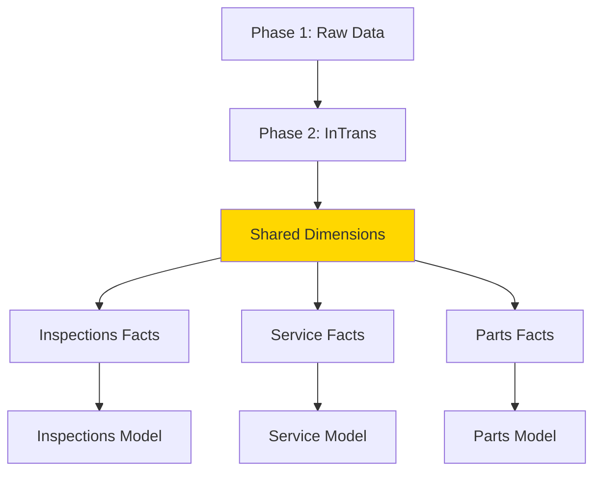
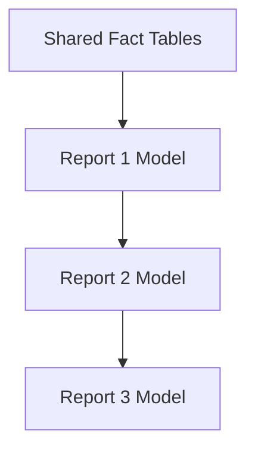
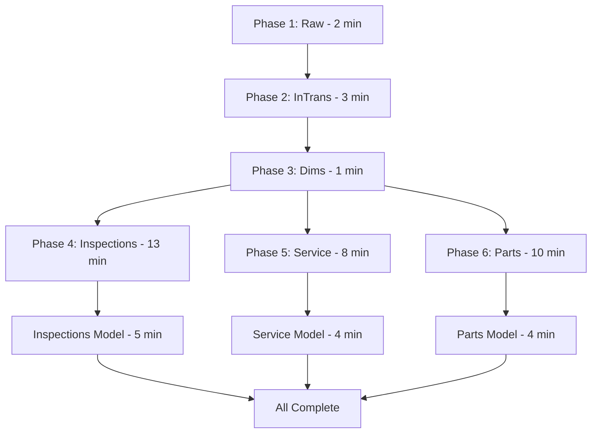

# Pipeline Scaling Guide: Adding Additional Reports

## Overview

This guide explains how to extend the current Inspections Report pipeline architecture to support additional Power BI reports while maintaining performance, manageable CU consumption, and system stability.

## Current Baseline

**Inspections Report Pipeline:**
```
Duration: 14-18 minutes
CU Usage: 5-7 CU per run
Phases: 4 (Raw → InTrans → Dimensions → Facts/Model)
Tables: 21 raw, 4 dimensions, 3 facts
Success Rate: 95%+
```

## Scaling Principles

### 1. Share Common Infrastructure

**Maximize Reuse:**
- ✅ Reuse Phase 1 (Raw Data) for all reports
- ✅ Reuse shared dimensions (DimBranch, DimEmployee, DimDate)
- ✅ Reuse InTrans_Incremental for parts-related reports
- ❌ Avoid duplicating raw tables or shared dimensions

**Benefits:**
- Reduces total refresh time
- Minimizes CU consumption
- Simplifies maintenance
- Ensures data consistency

### 2. Parallel Execution for Independent Reports

**When Reports Are Independent:**


**Phases 4+ can run in parallel** if they use different fact tables and semantic models.

### 3. Sequential for Dependent Reports

**When Reports Share Facts:**


**Must run sequentially** if semantic models reference the same fact tables.

## Adding a New Report: Step-by-Step

### Example: Adding "Service Efficiency Report"

#### Step 1: Assess Dependencies

**Questions to Answer:**
1. Does it use existing raw tables? ✅ (RAW_LABOR, RAW_WORKORDER)
2. Does it need new raw tables? ❌ (No new sources)
3. Does it use existing dimensions? ✅ (DimEmployee, DimBranch, DimDate)
4. Does it need new dimensions? ✅ (DimServiceType)
5. Does it use existing facts? ❌ (Needs Fact_ServiceMetrics)
6. Can it run parallel to Inspections? ✅ (Different facts)

#### Step 2: Design the New Phase

**Phase 5: Service Efficiency**

```json
{
  "name": "Pipeline_Facts_ServiceEfficiency",
  "activities": [
    {
      "name": "Refresh_DimServiceType",
      "type": "DataflowRefresh",
      "description": "New dimension specific to service report"
    },
    {
      "name": "Refresh_Fact_ServiceMetrics",
      "type": "DataflowRefresh",
      "dependsOn": ["Refresh_DimServiceType"]
    },
    {
      "name": "Refresh_SemanticModel_ServiceEfficiency",
      "type": "PowerBIDataset",
      "dependsOn": ["Refresh_Fact_ServiceMetrics"]
    }
  ]
}
```

**Dependencies:**
- Upstream: Phases 1, 2 (shared raw data)
- Parallel: Can run alongside Phase 4 (Inspections)
- Duration: ~8-12 minutes (estimate)

#### Step 3: Update Master Orchestrator

**Add Parallel Execution:**

```json
{
  "name": "Execute_Phase4_and_Phase5_Parallel",
  "type": "ExecuteParallel",
  "dependsOn": ["Execute_Phase3"],
  "activities": [
    {
      "name": "Execute_Phase4_Inspections",
      "type": "ExecutePipeline",
      "pipeline": "Pipeline_Facts_Inspections"
    },
    {
      "name": "Execute_Phase5_ServiceEfficiency",
      "type": "ExecutePipeline",
      "pipeline": "Pipeline_Facts_ServiceEfficiency"
    }
  ]
}
```

**Impact on Total Duration:**
```
Before: Phase 1 (2m) → Phase 2 (3m) → Phase 3 (1m) → Phase 4 (13m) = 19m

After: Phase 1 (2m) → Phase 2 (3m) → Phase 3 (1m) → Phase 4 || Phase 5 (13m) = 19m
                                                        (parallel)
```

**No increase in duration** if Phase 5 completes within Phase 4's timeframe!

#### Step 4: Test & Validate

**Testing Checklist:**

1. **Isolate Testing**
   ```
   ✅ Test new dimension refresh independently
   ✅ Test new fact refresh independently  
   ✅ Test semantic model refresh independently
   ✅ Validate data in Power BI report
   ```

2. **Integration Testing**
   ```
   ✅ Run Phase 5 after Phase 3 (manual trigger)
   ✅ Verify no interference with Phase 4
   ✅ Check CU consumption is within limits
   ✅ Confirm total duration acceptable
   ```

3. **Parallel Testing**
   ```
   ✅ Run Phase 4 and Phase 5 simultaneously
   ✅ Monitor for resource contention
   ✅ Verify both complete successfully
   ✅ Check combined CU usage
   ```

#### Step 5: Monitor & Optimize

**Key Metrics:**
- Total pipeline duration
- Individual phase durations
- CU consumption (total and per report)
- Success rate by phase
- Error frequency and types

**Optimization Opportunities:**
- If Phase 5 > Phase 4 duration, optimize Phase 5
- If CU approaching capacity limits, implement incremental refresh
- If errors frequent, add retry logic or enhance error handling

## Scaling Patterns

### Pattern 1: Star Schema (Recommended)

**Central shared resources with independent report branches:**

```
         Phase 1 (Raw)
              ↓
         Phase 2 (InTrans)
              ↓
         Phase 3 (Dimensions)
              ↓
    ┌─────────┼─────────┐
    ↓         ↓         ↓
  Phase 4   Phase 5   Phase 6
  (Inspect) (Service) (Parts)
    ↓         ↓         ↓
  Model 1   Model 2   Model 3
```

**Characteristics:**
- ✅ Phases 4+ run in parallel
- ✅ Minimal total duration increase
- ✅ Independent failures don't cascade
- ⚠️ Each report has unique facts

**Best For:** Reports with distinct analytical focus

### Pattern 2: Sequential Chain

**Reports depend on previous reports:**

```
Phase 1 → Phase 2 → Phase 3 → Phase 4 → Phase 5 → Phase 6
(Raw)    (InTrans)  (Dims)    (Report1)  (Report2)  (Report3)
```

**Characteristics:**
- ❌ Total duration = sum of all phases
- ❌ Single failure stops all downstream
- ✅ Simpler dependency management
- ✅ Easier troubleshooting

**Best For:** Reports that build on each other (summary → detail)

### Pattern 3: Hybrid (Most Common)

**Mix of shared infrastructure with parallel branches:**

```
Phase 1 (Raw)
    ↓
Phase 2 (InTrans)
    ↓
Phase 3 (Dimensions)
    ↓
Phase 4 (Shared Facts)
    ↓
    ┌─────────┼─────────┐
    ↓         ↓         ↓
  Model 1   Model 2   Model 3
  (Exec)    (Manager)  (Tech)
```

**Characteristics:**
- ✅ One fact table, multiple semantic models
- ✅ Models refresh in parallel
- ✅ Shared data ensures consistency
- ⚠️ Fact refresh is single point of failure

**Best For:** Multiple views of same data (role-based reports)

## CU Capacity Planning

### Calculate Required Capacity

**Current Inspections Report:**
```
Phase 1 (Raw): 1.0 CU
Phase 2 (InTrans): 1.5 CU
Phase 3 (Dims): 0.2 CU
Phase 4 (Facts): 3.0 CU
Phase 4 (Model): 1.5 CU
─────────────────────
Total: 7.2 CU
```

**Adding Service Efficiency Report:**
```
Shared Phases 1-3: Already counted
Phase 5 (ServiceFacts): 2.0 CU (estimate)
Phase 5 (ServiceModel): 1.2 CU (estimate)
─────────────────────────
Additional: 3.2 CU
```

**New Total: 10.4 CU per run**

### Capacity Sizing Guide

**Fabric Capacity Tiers:**
```
F2:  2 CU available  → 1 report max
F4:  4 CU available  → 1 report comfortably
F8:  8 CU available  → 2 reports comfortably
F16: 16 CU available → 3-4 reports comfortably
F32: 32 CU available → 6-8 reports comfortably
F64: 64 CU available → 12-16 reports comfortably
```

**Current Situation:**
- Capacity: F4 (4 CU)
- Current usage: ~7 CU per run
- Status: ⚠️ Over capacity, but using background smoothing

**Recommendation:**
- For 2 reports: Stay F4, optimize current report
- For 3+ reports: Upgrade to F8 or F16

### CU Optimization Strategies

**1. Implement Incremental Refresh**
```
Before: Full refresh = 3.0 CU
After: Incremental = 0.5 CU
Savings: 2.5 CU (83%)
```

**2. Optimize Query Folding**
```
Verify all queries fold to source
Avoid complex M functions
Push transformations to SQL
```

**3. Schedule Strategically**
```
Spread refresh times across day
Avoid concurrent heavy operations
Use weekday-only for non-critical reports
```

**4. Reduce Historical Range**
```
6 years → 3 years (if acceptable)
Can save 30-50% refresh time
Proportional CU savings
```

## Real-World Example: Three Report Architecture

### Reports
1. **Inspections Report** (existing)
2. **Service Efficiency Dashboard** (new)
3. **Parts Inventory Analysis** (new)

### Shared Infrastructure

**Phase 1: Raw Data**
- All 21 existing raw tables
- No additions needed

**Phase 2: InTrans Incremental**
- Used by Inspections and Parts reports
- Service doesn't need parts data

**Phase 3: Dimensions**
- DimBranch, DimEmployee, DimDate (shared by all)
- DimJobCode (Inspections and Service)
- DimPartCategory (Parts only - added)

### Report-Specific Phases

**Phase 4: Inspections (existing)**
```
Facts: LaborJobSummary, PartsTransactions, WorkOrderParts
Duration: 13 minutes
CU: 4.5
```

**Phase 5: Service Efficiency (parallel to Phase 4)**
```
Facts: ServiceMetrics, TechnicianPerformance
Duration: 8 minutes
CU: 3.0
```

**Phase 6: Parts Inventory (parallel to Phase 4 & 5)**
```
Facts: PartsOnHand, PartsMovement, PartsCosting
Duration: 10 minutes
CU: 3.5
```

### Total Architecture



**Performance:**
```
Sequential would be: 2 + 3 + 1 + 13 + 8 + 10 = 37 minutes

Parallel (Phases 4-6 simultaneous):
2 + 3 + 1 + 13 (longest) = 19 minutes

Time saved: 18 minutes (49% faster)
```

**CU Consumption:**
```
Phase 1-3: 2.7 CU (shared)
Phase 4:   4.5 CU
Phase 5:   3.0 CU  
Phase 6:   3.5 CU
──────────────────
Total:    13.7 CU per run

With F16 capacity: Well within limits ✅
```

## Troubleshooting Multi-Report Pipelines

### Issue: Parallel phases cause CU throttling

**Symptoms:** 
- Pipeline takes much longer than expected
- "Throttled" status in activity logs
- CU metrics show capacity exceeded

**Solutions:**
1. Stagger report refresh by 5-10 minutes
2. Optimize fact tables with incremental refresh
3. Upgrade Fabric capacity
4. Review and optimize long-running queries

### Issue: One report fails, blocks others

**Symptoms:**
- Report 2 can't start because Report 1 failed
- "Dependency not met" errors

**Solutions:**
1. Implement proper error handling with "continue on error"
2. Separate independent reports into truly parallel branches
3. Add retry logic at individual activity level
4. Create fallback paths for non-critical reports

### Issue: Reports show inconsistent data

**Symptoms:**
- Report A shows 100 transactions
- Report B shows 105 transactions for same period
- Users report discrepancies

**Solutions:**
1. Verify all reports use same raw tables (Phase 1)
2. Ensure dimension refresh (Phase 3) completes before facts
3. Check for caching issues in semantic models
4. Validate fact table transformations are consistent
5. Add data quality measures to compare report outputs

## Best Practices Summary

### Architecture
1. ✅ **Maximize shared infrastructure** - Reuse Phases 1-3
2. ✅ **Parallel when possible** - Independent reports run simultaneously
3. ✅ **Document dependencies** - Clear upstream/downstream relationships
4. ✅ **Plan for capacity** - Size Fabric capacity appropriately

### Development
1. ✅ **Test in isolation** - Validate each new report independently
2. ✅ **Incremental rollout** - Add one report at a time
3. ✅ **Monitor impact** - Track CU and duration changes
4. ✅ **Maintain documentation** - Update architecture diagrams

### Operations
1. ✅ **Monitor per-report metrics** - Individual success rates and durations
2. ✅ **Set appropriate alerts** - Different thresholds for different reports
3. ✅ **Schedule strategically** - Balance load across day/week
4. ✅ **Regular optimization** - Review and improve quarterly

### Scaling Limits
- **F4 Capacity:** 1-2 reports comfortably
- **F8 Capacity:** 3-4 reports comfortably
- **F16 Capacity:** 6-8 reports comfortably
- **Beyond F16:** Consider separate workspaces or capacities

## Checklist: Adding a New Report

Before adding a new report to the pipeline:

**Planning Phase:**
- [ ] Identify report requirements (facts, dimensions, frequency)
- [ ] Assess dependency on existing infrastructure
- [ ] Estimate CU consumption (test in isolation)
- [ ] Determine parallel vs. sequential execution
- [ ] Calculate impact on total pipeline duration
- [ ] Verify Fabric capacity can handle additional load

**Development Phase:**
- [ ] Create new dataflows for unique fact tables
- [ ] Add new dimensions if needed
- [ ] Test individual dataflows independently
- [ ] Create semantic model
- [ ] Develop Power BI report
- [ ] Test end-to-end refresh manually

**Integration Phase:**
- [ ] Add new phase to master orchestrator
- [ ] Implement proper dependency logic
- [ ] Configure error handling and retries
- [ ] Add logging for new phase
- [ ] Test parallel execution (if applicable)
- [ ] Validate no interference with existing reports

**Production Phase:**
- [ ] Deploy to production workspace
- [ ] Schedule initial refresh
- [ ] Monitor first 5 refreshes closely
- [ ] Validate data accuracy
- [ ] Train users on new report
- [ ] Document new phase in architecture guide

**Post-Deployment:**
- [ ] Review CU consumption patterns
- [ ] Optimize if needed (incremental refresh, query tuning)
- [ ] Update monitoring dashboards
- [ ] Add to troubleshooting guide
- [ ] Schedule quarterly performance review

---

**Related Documentation:**
- [Architecture Overview](./architecture-overview.md)
- [Master Orchestrator](./master-orchestrator.md)
- [Troubleshooting Guide](./troubleshooting-guide.md)