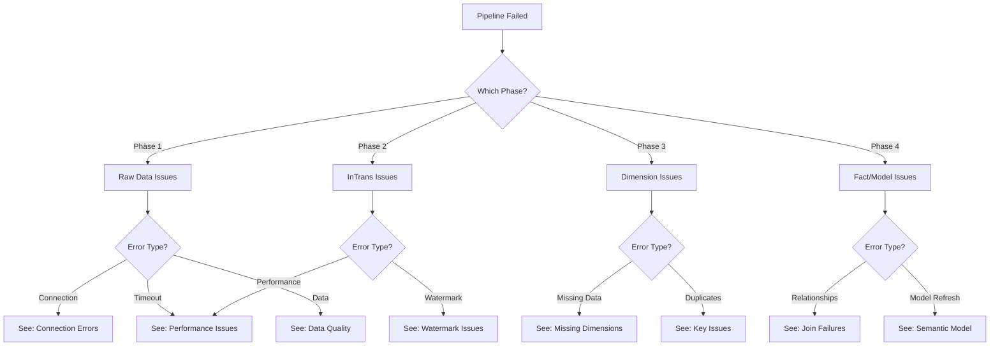

# Pipeline Troubleshooting Guide

## Overview

This guide provides systematic troubleshooting approaches for the Inspections Report pipeline system, organized by phase and common symptoms.

## Quick Diagnosis Flowchart



## Phase 1: Raw Data Issues

### Issue: ODBC Connection Failures

**Symptoms:**
```
Error: "Unable to connect to data source"
Error: "Connection timeout"
Activity status: Failed immediately
```

**Diagnosis:**
```powershell
# Test ODBC connection manually
Test-NetConnection -ComputerName [server] -Port 1433

# Check if DSN exists and is accessible
Get-OdbcDsn -Name "YourDSN"
```

**Common Causes:**
1. Source system offline or unreachable
2. Network connectivity issues
3. Credentials expired or changed
4. Firewall blocking connection
5. ODBC driver not installed/updated

**Solutions:**
1. **Verify source system availability:**
   ```
   - Check with ERP team if system is up
   - Verify maintenance windows
   - Test connection from Fabric gateway
   ```

2. **Update credentials:**
   ```
   - Fabric Portal → Settings → Data source credentials
   - Update username/password
   - Test connection
   ```

3. **Check firewall rules:**
   ```
   - Verify IP whitelisting for Fabric
   - Check network security groups
   - Contact network team if needed
   ```

4. **Retry configuration:**
   ```json
   {
     "retryPolicy": {
       "count": 3,
       "intervalInSeconds": 300
     }
   }
   ```

### Issue: Source Table Missing or Empty

**Symptoms:**
```
Dataflow completes but table has 0 rows
Error: "Table does not exist"
Expected: 10K+ rows, Got: 0 rows
```

**Diagnosis:**
```sql
-- Run directly on source system
SELECT COUNT(*) FROM [SourceTable]
SELECT TOP 10 * FROM [SourceTable]
```

**Solutions:**
1. **Verify table name:** Check for typos, case sensitivity
2. **Check permissions:** Ensure service account has SELECT rights
3. **Validate query:** Test SQL directly on source system
4. **Review filters:** May be filtering out all data unintentionally

**Prevention:**
```dax
// Create alert measure
Raw Table Row Count Check = 
VAR ExpectedMin = 1000
VAR ActualCount = COUNTROWS(RAW_LABOR)
RETURN
IF(
    ActualCount < ExpectedMin,
    "⚠ Only " & ActualCount & " rows (expected " & ExpectedMin & "+)",
    "✓ " & ActualCount & " rows"
)
```

### Issue: Dataflow Timeout / Long Duration

**Symptoms:**
```
Duration: 30+ minutes (normal: 5-10 min)
Status: Running... (never completes)
CU consumption: Spike during refresh
```

**Diagnosis:**
```sql
-- Check source table row count
SELECT COUNT(*) FROM [SourceTable]

-- Check for long-running queries on source
-- (specific to your ERP system)
```

**Solutions:**
1. **Optimize source query:**
   ```sql
   -- Add filters to reduce data volume
   WHERE TransDate >= DATEADD(YEAR, -6, GETDATE())
   
   -- Avoid complex joins at source
   -- Move transformations to Fabric if possible
   ```

2. **Verify query folding:**
   ```
   Power Query Editor → Right-click step → View Native Query
   If you see SQL, folding is working ✓
   ```

3. **Split into smaller tables:**
   ```
   Instead of: One dataflow with 21 queries
   Consider: 21 dataflows running in parallel
   (Already implemented in Phase 1)
   ```

4. **Check concurrent operations:**
   ```
   - Are other heavy workloads running?
   - Is capacity being throttled?
   - Review Capacity Metrics dashboard
   ```

## Phase 2: InTrans Incremental Issues

### Issue: Watermark Not Updating

**Symptoms:**
```
InTrans_Incremental refreshes successfully
Same data loaded every time
Watermark table shows old date/time
```

**Diagnosis:**
```sql
-- Check watermark table
SELECT * FROM Watermark_InTrans
WHERE TableName = 'InTrans'

-- Check if watermark update activity ran
-- Review pipeline run history for DF_Update_Watermark_InTrans
```

**Solutions:**
1. **Verify activity sequence:**
   ```json
   {
     "name": "Update_Watermark",
     "dependsOn": [{
       "activity": "Refresh_InTrans_Incremental",
       "dependencyConditions": ["Succeeded"]
     }]
   }
   ```

2. **Check permissions:**
   ```
   Ensure dataflow has write access to watermark table
   ```

3. **Review update logic:**
   ```powerquery
   // Verify update dataflow calculates new max correctly
   NewMaxValue = List.Max(InTransTable[TransDatetime])
   ```

4. **Manual reset if needed:**
   ```sql
   -- Advance watermark manually
   UPDATE Watermark_InTrans
   SET LastMaxValue = '2024-11-20 00:00:00',
       LastRefreshDate = GETDATE()
   WHERE TableName = 'InTrans'
   ```

### Issue: Missing Recent Transactions

**Symptoms:**
```
Report shows data through yesterday
Today's transactions missing
Transactions from last few hours absent
```

**Diagnosis:**
```sql
-- Check InTrans_Incremental
SELECT MAX(TransDatetime) FROM InTrans_Incremental
-- Compare to current time

-- Check source system
SELECT MAX(TransDatetime) FROM InTransSourceTable
-- Should be more recent than InTrans_Incremental
```

**Root Causes:**
1. Watermark too far ahead (loaded future data, set watermark, then backfilled)
2. Source system timestamps not in sync
3. Transactions being backdated in source
4. Time zone issues

**Solutions:**
1. **Add buffer to query:**
   ```powerquery
   // Load last 2 hours again to catch stragglers
   WHERE TransDatetime >= DATEADD(HOUR, -2, LastMaxValue)
   ```

2. **Check time zones:**
   ```
   Ensure all timestamps in same time zone
   UTC vs. Local time can cause 5-6 hour gaps
   ```

3. **Implement reconciliation:**
   ```sql
   -- Daily check: Compare source vs. Fabric
   SELECT COUNT(*), SUM(ExtendedCost)
   FROM InTransTable
   WHERE TransDatetime >= DATEADD(DAY, -7, GETDATE())
   ```

### Issue: InTrans Performance Regression

**Symptoms:**
```
Incremental refresh taking 10-15+ minutes
Used to take 2-3 minutes
CU consumption increased
```

**Diagnosis:**
```sql
-- Check how many rows being loaded
SELECT COUNT(*) 
FROM InTransTable
WHERE TransDatetime > '2024-11-20 00:00:00'  -- Use actual watermark value

-- Should be: 50-500 per day
-- If thousands+, investigate why
```

**Common Causes:**
1. Watermark stuck at old date (loading months of data)
2. Query not folding (pulling all data, filtering in Fabric)
3. Network performance degradation
4. Source system performance issues

**Solutions:**
1. **Verify watermark current:**
   ```sql
   SELECT LastMaxValue, DATEDIFF(HOUR, LastMaxValue, GETDATE()) AS HoursBehind
   FROM Watermark_InTrans
   -- HoursBehind should be < 24
   ```

2. **Check query folding:**
   ```
   View Native Query in Power Query
   Verify WHERE clause is in SQL, not M
   ```

3. **Review source system:**
   ```
   Check for: Table locks, index fragmentation, query plan changes
   ```

4. **Consider further optimization:**
   ```
   - Add indexes on TransDatetime in source
   - Partition by year/quarter
   - Load in smaller batches (multiple watermarks)
   ```

## Phase 3: Dimension Issues

### Issue: Dimension Table Empty After Refresh

**Symptoms:**
```
DimBranch, DimEmployee, etc. have 0 rows
Dataflow completes successfully
Expected: 50-1000 rows depending on table
```

**Diagnosis:**
```sql
-- Check source tables
SELECT COUNT(*) FROM RAW_BRANCH
SELECT COUNT(*) FROM RAW_EMPLOYEE

-- Review dataflow query
-- Check for: Aggressive filters, failed joins, column mismatches
```

**Solutions:**
1. **Verify source data exists:**
   ```sql
   SELECT TOP 10 * FROM RAW_BRANCH
   ```

2. **Check dataflow transformations:**
   ```powerquery
   // Remove filters temporarily
   // Test query without WHERE clauses
   // Add filters back one at a time
   ```

3. **Review data type conversions:**
   ```powerquery
   // Ensure type conversions don't error out
   // Example: BranchID must be text, not null
   ```

### Issue: Duplicate Keys in Dimension

**Symptoms:**
```
Error: "Duplicate key found"
Relationship errors in semantic model
Report shows wrong data or errors
```

**Diagnosis:**
```sql
-- Find duplicates
SELECT BranchID, COUNT(*) 
FROM DimBranch
GROUP BY BranchID
HAVING COUNT(*) > 1

SELECT EmployeeID, COUNT(*)
FROM DimEmployee
GROUP BY EmployeeID
HAVING COUNT(*) > 1
```

**Root Causes:**
1. Source table has duplicates
2. Dataflow query creates duplicates (cross join accidentally)
3. Multiple active records without proper filtering

**Solutions:**
1. **Add DISTINCT in dataflow:**
   ```powerquery
   // Group by key column, take first row
   = Table.Group(
       Source, 
       {"BranchID"}, 
       {{"FirstRow", each List.First([AllRows]), type record}}
   )
   ```

2. **Identify and fix source issue:**
   ```sql
   -- Find what makes them different
   SELECT * 
   FROM RAW_BRANCH
   WHERE BranchID IN (
       SELECT BranchID FROM RAW_BRANCH 
       GROUP BY BranchID HAVING COUNT(*) > 1
   )
   ORDER BY BranchID
   ```

3. **Implement deduplication logic:**
   ```powerquery
   // Take most recent record
   = Table.Group(
       Source,
       {"BranchID"},
       {{"AllRows", each _, type table},
        {"MaxDate", each List.Max([LastModified]), type datetime}}
   )
   ```

### Issue: Missing Required Dimension Records

**Symptoms:**
```
Fact records don't join to dimension
DimJobCode missing inspection codes
DimBranch missing new locations
```

**Diagnosis:**
```dax
// Find orphaned fact records
Orphaned Labor Records = 
CALCULATE(
    COUNTROWS(Fact_LaborJobSummary),
    ISBLANK(RELATED(DimJobCode[JobDescription]))
)
```

**Solutions:**
1. **Add "Unknown" default record:**
   ```powerquery
   // Ensure dimension has catch-all
   = Table.InsertRows(
       Source,
       0,
       {[
           BranchID = "UNKNOWN",
           BranchName = "Unknown Location",
           IsActive = true
       ]}
   )
   ```

2. **Verify source includes all needed records:**
   ```sql
   -- Check for active flag filtering out needed records
   SELECT * FROM RAW_JOBCODE
   WHERE IsActive = 1  -- Are inactive codes needed?
   ```

3. **Update fact table to handle nulls:**
   ```powerquery
   // Replace null keys with "UNKNOWN"
   = Table.ReplaceValue(
       Source,
       null,
       "UNKNOWN",
       Replacer.ReplaceValue,
       {"BranchID"}
   )
   ```

## Phase 4: Fact & Semantic Model Issues

### Issue: Fact Table Joins Failing (0% Success)

**Symptoms:**
```
Fact table loads successfully
All dimension lookups return BLANK
RELATED() returns null for all rows
Report shows "no data"
```

**Diagnosis:**
```dax
// Check join success rate
Join Success Rate = 
VAR TotalRows = COUNTROWS(Fact_LaborJobSummary)
VAR JoinedRows = CALCULATE(
    COUNTROWS(Fact_LaborJobSummary),
    NOT(ISBLANK(RELATED(DimBranch[BranchName])))
)
RETURN
DIVIDE(JoinedRows, TotalRows, 0)

// Should be: 95-100%
// If 0%, data type mismatch or key mismatch
```

**Root Cause:**
```
90% of the time: Data type mismatch
Example: Fact.WorkOrder = Integer
         Dim.WorkOrder = Text
Result: No matches ❌
```

**Solutions:**
1. **Check data types in both tables:**
   ```powerquery
   // In fact table
   Table.TransformColumnTypes(Source, {
       {"WorkOrder", Int64.Type},
       {"BranchID", type text}
   })
   
   // In dimension
   Table.TransformColumnTypes(Source, {
       {"BranchID", type text}
   })
   
   // BranchID types match ✓
   ```

2. **Add WorkOrder_Text if needed:**
   ```sql
   -- In source query
   SELECT 
       WorkOrder,
       CAST(WorkOrder AS VARCHAR(50)) AS WorkOrder_Text
   FROM SourceTable
   ```

3. **Validate sample joins:**
   ```sql
   -- Test join in source database
   SELECT COUNT(*)
   FROM FactTable f
   INNER JOIN DimTable d ON f.JoinKey = d.JoinKey
   
   -- If 0 results, keys don't match at source level
   ```

### Issue: Semantic Model Refresh Fails

**Symptoms:**
```
Error: "Table 'TableName' not found"
Error: "Relationship could not be created"
Model refresh fails but facts refreshed successfully
```

**Diagnosis:**
```
1. Check if table names match exactly (case-sensitive)
2. Verify table exists in lakehouse
3. Check semantic model configuration
4. Review relationship settings
```

**Common Causes:**
1. **Table name mismatch:**
   ```
   Lakehouse: Fact_LaborJobSummary
   Semantic Model: fact_laborjobsummary
   Result: Not found ❌
   ```

2. **Table dropped during refactoring:**
   ```
   Renamed table but didn't update semantic model
   ```

3. **Relationship issues:**
   ```
   Many-to-many not supported
   Both sides must have compatible cardinality
   ```

**Solutions:**
1. **Verify table name casing:**
   ```
   Use EXACT names from lakehouse
   Case-sensitive match required
   ```

2. **Check table selection in pipeline:**
   ```json
   {
     "type": "PowerBIDataset",
     "typeProperties": {
       "objects": [
         {
           "table": "Fact_LaborJobSummary"  // Must match exactly
         }
       ]
     }
   }
   ```

3. **Remove problematic table parameter:**
   ```
   Don't specify tables → refresh all tables
   Simpler, less prone to errors
   ```

4. **Recreate relationships if needed:**
   ```
   Power BI Desktop → Manage Relationships
   Delete and recreate failing relationships
   Verify cardinality and cross-filter settings
   ```

### Issue: Report Shows Stale Data

**Symptoms:**
```
Pipeline shows "Success"
Fact tables have latest data
Report still shows yesterday's data
Users complaining about outdated info
```

**Diagnosis:**
```dax
Last Fact Refresh = MAX(Fact_LaborJobSummary[RefreshDateTime])
Current Time = NOW()
Hours Since Refresh = DATEDIFF([Last Fact Refresh], [Current Time], HOUR)

// Should be: < 24 hours
// If > 24, semantic model didn't refresh
```

**Solutions:**
1. **Verify semantic model actually refreshed:**
   ```
   Power BI Service → Workspace → Dataset → Refresh History
   Check: Did refresh complete after fact tables?
   ```

2. **Clear cache:**
   ```
   Power BI Service → Dataset → Settings → Clear Cache
   Or: End-users press Ctrl+F5 in browser
   ```

3. **Check for multiple semantic models:**
   ```
   Are users looking at archived/development model?
   Verify they're using production workspace/report
   ```

4. **Review refresh schedule:**
   ```
   Ensure semantic model refresh runs AFTER fact refresh
   Not before or in parallel
   ```

### Issue: CU Throttling During Fact Refresh

**Symptoms:**
```
Fact refresh takes 30+ minutes (normal: 13 min)
Capacity Metrics show throttling
Pipeline operations delayed
"Throttled" status in activity logs
```

**Diagnosis:**
```
1. Check Fabric Capacity Metrics (Admin Portal)
2. Look for: CU consumption spikes
3. Review: Concurrent operations
4. Identify: Which tables consuming most CU
```

**Solutions:**
1. **Stagger refreshes:**
   ```json
   {
     "concurrency": 2  // Instead of 3
   }
   // Refresh 2 facts at a time, not all 3
   ```

2. **Implement incremental refresh on facts:**
   ```
   Fact_LaborJobSummary → Partition by JobDate
   Only refresh last 3 months (rolling window)
   Historical partitions unchanged
   ```

3. **Optimize query performance:**
   ```sql
   -- Add indexes to source tables
   CREATE INDEX IX_JobDate ON LaborTable(JobDate)
   
   -- Reduce data volume
   WHERE JobDate >= DATEADD(YEAR, -6, GETDATE())  -- Not -10
   ```

4. **Schedule during off-peak:**
   ```
   Current: 6:00 AM (may conflict with other workloads)
   Consider: 4:00 AM or 12:00 AM
   ```

5. **Upgrade capacity:**
   ```
   F4 → F8 (doubles available CU)
   Cost-benefit analysis:
   - Increased spend
   + Eliminated throttling
   + Faster refreshes
   + Room for growth
   ```

## Performance Issues (General)

### Issue: Pipeline Taking Much Longer Than Expected

**Symptom:**
```
Expected: 14-18 minutes total
Actual: 30-60 minutes
Inconsistent duration day-to-day
```

**Systematic Diagnosis:**

1. **Identify bottleneck phase:**
   ```
   Phase 1 slow → Raw data issues
   Phase 2 slow → Incremental refresh not working
   Phase 3 slow → Dimension performance (rare)
   Phase 4 slow → Fact or model issues
   ```

2. **Review activity durations:**
   ```
   Pipeline Run History → Click run → Activity durations
   Sort by: Duration (descending)
   Identify: Longest-running activity
   ```

3. **Check CU consumption:**
   ```
   Capacity Metrics → Operations → Filter by time range
   Look for: Spikes or sustained high usage
   ```

4. **Compare to baseline:**
   ```
   Average duration last 30 days vs. today
   Identify: When did slowdown start?
   Correlate: Any changes made around that time?
   ```

**Common Fixes:**

1. **Query optimization**
2. **Incremental refresh** (where applicable)
3. **Parallel execution** (where possible)
4. **Capacity upgrade** (if consistently slow)
5. **Data volume reduction** (if historical data excessive)

## Data Quality Issues

### Issue: Incorrect Totals or Aggregations

**Symptoms:**
```
Labor hours don't match source system
Parts costs are off by significant amount
User reports: "These numbers don't look right"
```

**Diagnosis:**
```dax
// Compare aggregates
Fabric Total Cost = SUM(Fact_PartsTransactions[ExtendedCost])

// Run same in source system:
// SELECT SUM(ExtendedCost) FROM InTransTable
// WHERE ...

// Should match within rounding
```

**Root Causes:**
1. Data type issues causing truncation
2. Currency conversion errors
3. Joins creating duplication
4. Filters excluding data unintentionally
5. Time zone mismatches for date-based aggregations

**Solutions:**
1. **Validate at each transformation step:**
   ```powerquery
   // Add check after each major transformation
   CountBeforeJoin = Table.RowCount(TableA)
   CountAfterJoin = Table.RowCount(JoinedTable)
   // Should be expected ratio
   ```

2. **Implement reconciliation measures:**
   ```dax
   Source System Total = [Manual Entry from Source]
   Fabric Total = SUM(FactTable[Amount])
   Variance = [Fabric Total] - [Source System Total]
   Variance % = DIVIDE([Variance], [Source System Total], 0)
   
   // Alert if > 1% variance
   ```

3. **Review distinct counts:**
   ```dax
   Unique WorkOrders = DISTINCTCOUNT(Fact_LaborJobSummary[WorkOrder])
   // Compare to source system
   // Should match exactly
   ```

### Issue: Missing Data for Specific Date Range

**Symptoms:**
```
Report shows data for most dates
Specific dates or date ranges missing
No obvious pattern (not just recent)
```

**Diagnosis:**
```dax
// Create date coverage analysis
Date Coverage = 
ADDCOLUMNS(
    CALENDAR(MIN(Fact[Date]), MAX(Fact[Date])),
    "HasData", 
    CALCULATE(COUNTROWS(Fact)) > 0
)

// Identify: Which dates have HasData = FALSE
```

**Solutions:**
1. **Check source system for those dates:**
   ```sql
   SELECT COUNT(*), MIN(TransDate), MAX(TransDate)
   FROM SourceTable
   WHERE TransDate BETWEEN '2024-01-15' AND '2024-01-20'
   ```

2. **Review incremental refresh watermarks:**
   ```sql
   SELECT * FROM Watermark_InTrans
   -- Was watermark incorrectly advanced past that date range?
   ```

3. **Look for date filter issues:**
   ```powerquery
   // Check for filters that might exclude specific dates
   WHERE Date >= X AND Date <= Y
   // Ensure date range includes missing dates
   ```

4. **Full refresh to backfill if needed:**
   ```sql
   -- Temporarily reset watermark to earlier date
   UPDATE Watermark_InTrans
   SET LastMaxValue = '2024-01-01'
   
   -- Run refresh
   -- Will reload Jan 1 through present
   ```

## Monitoring & Alerts

### Recommended Alert Conditions

**Critical Alerts (Immediate Action):**
```
🔴 Pipeline failure (any phase)
🔴 Duration > 30 minutes
🔴 CU throttling detected
🔴 Semantic model refresh fails
🔴 Row count drops by 20%+
```

**Warning Alerts (Review Within 4 Hours):**
```
⚠️ Duration > 20 minutes
⚠️ CU usage > 10
⚠️ Watermark not advancing
⚠️ Row count deviation 5-20%
⚠️ Success rate < 95% (weekly)
```

**Info Alerts (Review Daily):**
```
ℹ️ Duration trends increasing
ℹ️ CU usage trends increasing
ℹ️ New orphaned records detected
ℹ️ Performance compared to baseline
```

### Monitoring Queries

**Daily Health Check Dashboard:**

```dax
// Pipeline Success Rate (Last 7 Days)
Success Rate = 
VAR Successes = CALCULATE(
    COUNTROWS(RefreshLog),
    RefreshLog[Status] = "Success",
    RefreshLog[RefreshDate] >= TODAY() - 7
)
VAR Total = CALCULATE(
    COUNTROWS(RefreshLog),
    RefreshLog[RefreshDate] >= TODAY() - 7
)
RETURN DIVIDE(Successes, Total, 0)

// Average Duration Trend
Avg Duration (7-Day Trend) = 
CALCULATE(
    AVERAGE(RefreshLog[DurationMinutes]),
    RefreshLog[RefreshDate] >= TODAY() - 7
)

// CU Consumption (Last 30 Days)
Total CU (30 Days) = 
CALCULATE(
    SUM(RefreshLog[CUUsed]),
    RefreshLog[RefreshDate] >= TODAY() - 30
)

// Latest Refresh Status
Latest Refresh = 
VAR LatestRun = MAX(RefreshLog[RefreshDate])
RETURN
CALCULATE(
    MAX(RefreshLog[Status]),
    RefreshLog[RefreshDate] = LatestRun
)
```

## Best Practices for Troubleshooting

### 1. Check Logs First
```
Always start with pipeline run history and activity logs
Fabric provides detailed error messages
Often the solution is in the error text
```

### 2. Isolate the Problem
```
Test components individually
Narrow down to specific table/activity
Reproduce in isolation
```

### 3. Compare to Baseline
```
When did issue start?
What changed since last successful run?
Review recent deployments or config changes
```

### 4. Document Everything
```
Keep troubleshooting log
What you tried, what didn't work
Eventually find root cause
Document solution for next time
```

### 5. Prevention Over Reaction
```
Implement monitoring before issues occur
Set up alerts for key metrics
Regular performance reviews
Proactive optimization
```

## Emergency Procedures

### Complete Pipeline Failure (All Phases)

**Immediate Actions:**
1. Check Fabric service status (Microsoft status page)
2. Verify source systems are online
3. Review capacity metrics for outages
4. Check for planned maintenance windows

**Recovery Steps:**
1. Identify failed phase
2. Fix underlying issue
3. Restart from failed phase (not from beginning)
4. Validate data integrity after restart
5. Notify stakeholders of delay

### Data Corruption Detected

**Symptoms:**
```
Aggregates wildly off
Duplicate records
Missing relationships
Report completely broken
```

**Recovery:**
1. **Stop all refreshes immediately**
2. **Identify corruption source:**
   ```sql
   Compare source system to Fabric
   Identify: Which table(s) corrupted
   Determine: When did corruption start
   ```
3. **Restore from backup if available**
4. **Otherwise, full refresh all tables:**
   ```sql
   -- Reset watermarks
   -- Drop and recreate affected tables
   -- Run full pipeline from Phase 1
   ```
5. **Validate before resuming production:**
   ```
   Compare totals to source system
   Verify key relationships work
   Test all report visuals
   User acceptance testing
   ```

### Source System Extended Outage

**If source down for 6+ hours:**

1. **Notify users** - Report will be stale
2. **Document outage** - Start time, expected duration
3. **Skip scheduled refreshes** - Don't waste retries
4. **When source returns:**
   ```
   - Run full pipeline
   - May need to reset watermarks if data backfilled
   - Extra validation of data completeness
   ```

---

## Quick Reference: Common Error Messages

| Error Message | Likely Cause | Quick Fix |
|--------------|-------------|-----------|
| "Unable to connect" | ODBC/Network issue | Check credentials, test connection |
| "Query does not fold" | Complex M transformation | Simplify query, push to SQL |
| "Table not found" | Name mismatch | Check spelling, case sensitivity |
| "Duplicate key" | Multiple records same key | Add DISTINCT or deduplication |
| "Timeout" | Long-running query | Optimize query, add indexes |
| "Permission denied" | Security/access issue | Grant permissions, update credentials |
| "Out of memory" | Large dataset | Reduce data volume, optimize types |
| "Throttled" | CU capacity exceeded | Stagger refreshes, upgrade capacity |

---

**Related Documentation:**
- [Architecture Overview](./architecture-overview.md)
- [Phase 1: Raw Data](./phase-1-raw-data.md)
- [Phase 2: InTrans Incremental](./phase-2-intrans-incremental.md)
- [Phase 3: Dimensions](./phase-3-dimensions.md)
- [Phase 4: Facts & Semantic Models](./phase-4-facts-semantic-models.md)
- [Master Orchestrator](./master-orchestrator.md)
- [Migration Guide](./migration-guide-intrans.md)