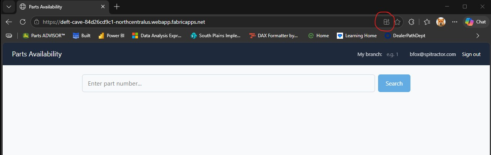
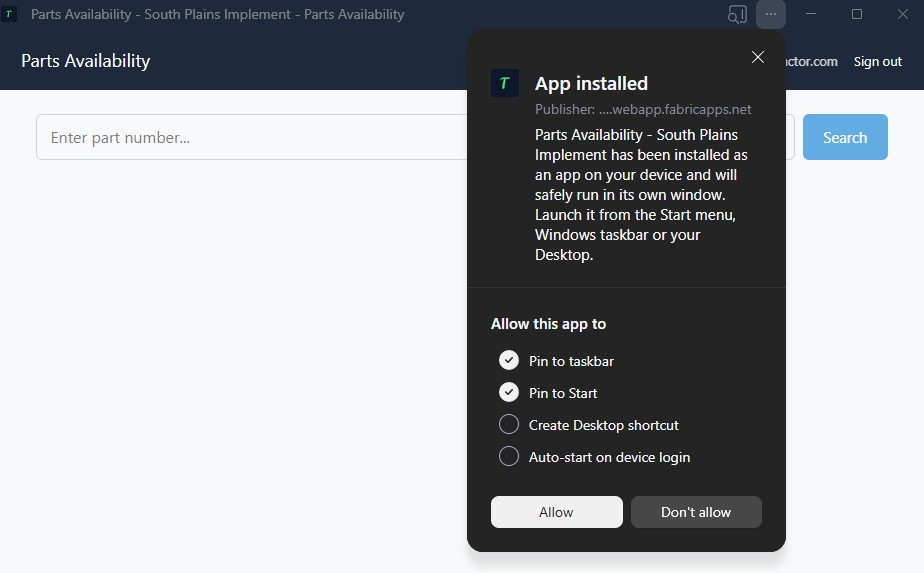

# Parts Availability — Install Guide

This tool replaces the old in-store part lookup — enter a part number, see every
branch that carries it. It works like a regular app once installed: its own
window, no browser tabs or address bar to deal with.

**Takes about 1 minute, one time per computer.**

---

## Step 1 — Open the app

1. Go to the Parts SharePoint site (Home page)
2. Click the yellow **Parts Availability** button
3. Sign in with your normal Microsoft/work account if asked

## Step 2 — Install it

Look at the right side of the address bar at the top of the window for the
**install icon**, circled below:

Click it, then click **Install** on the popup that appears.

Don't see the icon? Click the **"⋯" (three dots)** menu in the top-right of
the browser instead → **Apps** → **Install this site as an app**

## Step 3 — Confirm and pin

After installing, you'll see a confirmation like this:

**"Pin to taskbar"** and **"Pin to Start"** are already checked for you —
just click **Allow**. The app is now pinned and ready to use any time,
straight from your taskbar or Start menu, no need to go back through
SharePoint again.

---

## Using it

- **Type a part number** and click Search (or press Enter)
- Results show every branch carrying that part, with bin, quantity, price,
  supersession info, and comments
- **Set "My branch"** once (top right) — your branch's result will always
  show first and be highlighted
- **Click any column header** to sort by it

## Questions or something not working?

Contact Brian Fox.
